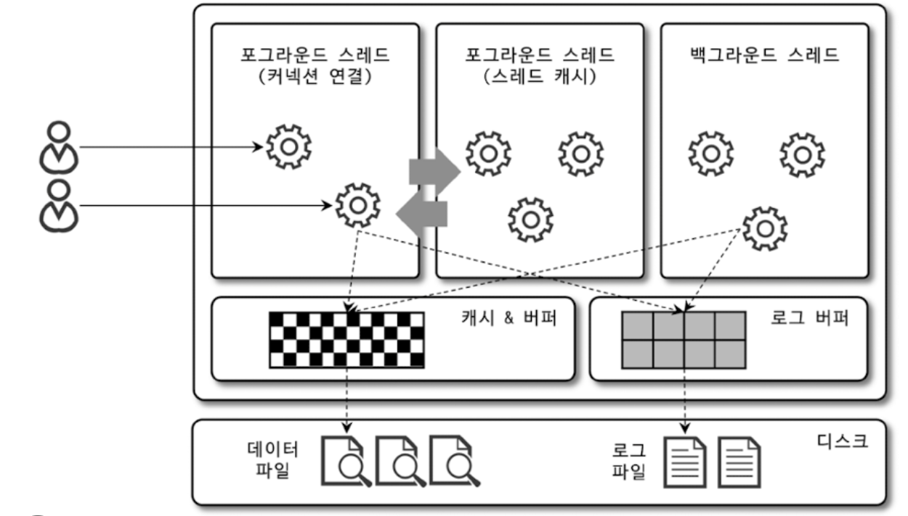
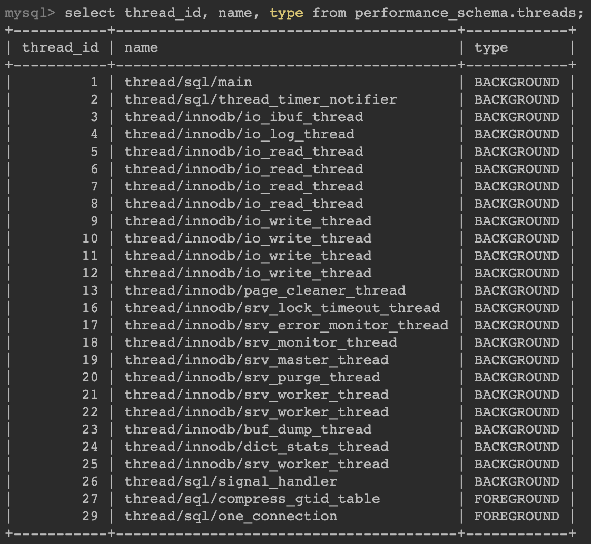
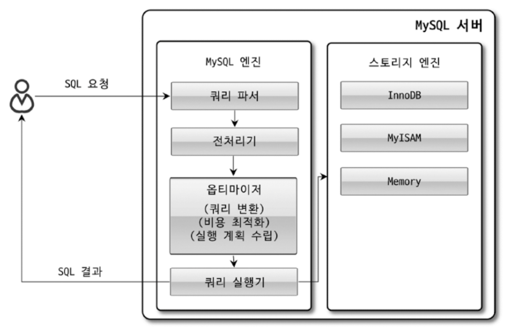
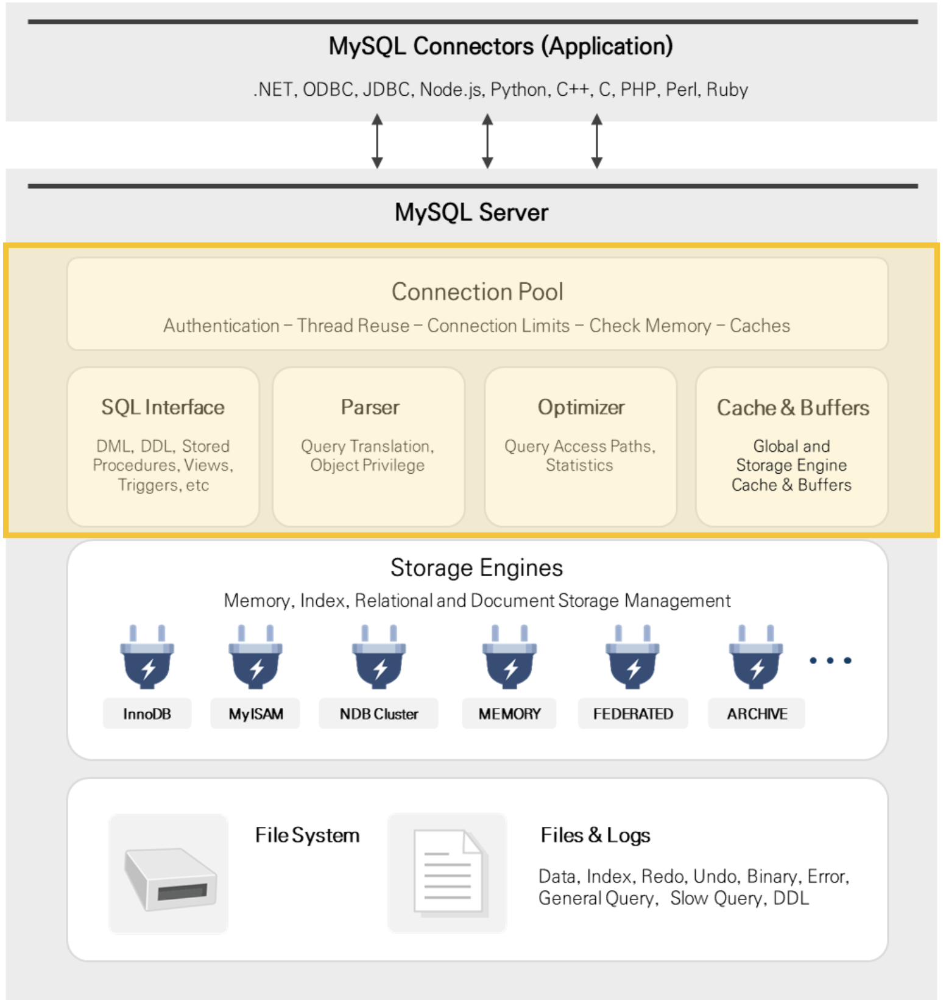

# 4.1 MySQL 엔진 아키텍쳐

날짜: 2023년 1월 7일
발표자: 이승한 연구원, 이현동 연구원

# MySQL 엔진 아키텍쳐



## MySQL 서버

MySQL 서버는 크게 두 가지로 이루어져있다. 이 둘을 합쳐 MySQL 또는 MySQL 서버라고 부른다.

- MySQL 엔진
- 스토리지 엔진

### MySQL 엔진

- 커넥션 핸들러
    - 클라이언트로부터의 접속을 처리
- SQL 인터페이스, SQL 파서, SQL 옵티마이저, 캐시 & 버퍼
    - 클라이언트로부터의 쿼리 요청을 처리 (SQL 문장을 분석하거나 최적화하는 중요한 역할을 한다)

### 스토리지 엔진

- 여러 스토리지 엔진이 존재 (대표적인 예: InnoDB, MyISAM, Memory..)

스토리지 엔진은 실제 디스크로부터 데이터를 읽어오거나 저장하는 역할을 전담한다.

```sql
mysql> CREATE TABLE test (fd1 INT, fd2 INT) ENGINE=INNODB;
```

위 코드는 test 테이블을 InnoDB 엔진을 사용하도록 설정한 것이다.

### 핸들러 API

MySQL 엔진의 쿼리 실행기에서 데이터를 IO할때 각 스토리지 엔진에 IO 요청을 하게 되는데 이때 핸들러 API를 통해 각 MySQL 엔진과 데이터를 주고 받는다.

---

## MySQL 스레드 구조



MySQL 서버는 프로세스 기반이 아닌, 스레드 기반으로 작동한다. 크게 두 가지 스레드로 나뉜다.

- `포그라운드 스레드`
- `백그라운드 스레드`



- `29 thread/sql/one_connection` 스레드는 실제 사용자 요청을 처리하는 포그라운드 스레드이다.

### 포그라운드 스레드(= 클라이언트 스레드)

포그라운드 스레드는 최소한 MySQL 서버에 접속된 **클라이언트 수**만큼 존재한다.

다음의 라이프사이클 주기를 가진다.

- 클라이언트가 접속하면 스레드 캐시에 있는지 확인
    - 없다면 새로운 포그라운드 스레드 생성
- 사용자가 작업을 마치고 커넥션 종료 시 `스레드 캐시`에 저장
    - 이때 만약, 스레드 캐시에 ***일정 개수 이상의 스레드**가 존재하면 저장하지 않고 버림
        - *유지할 수 있는 최대 개수는 `thread_cache_size` 시스템 변수로 설정

<aside>
💡 포그라운드 스레드는 데이터를 MySQL의 데이터 버퍼나 캐시로부터 가져오며, 없을 경우에는 직접 디스크나 인덱스 파일로부터 데이터를 읽어와서 작업을 처리한다.

</aside>

InnoDB 테이블은 데이터 버퍼나 캐시까지만 포그라운드 스레드로 처리하고, 버퍼로부터 디스크까지 저장하는 작업은 백그라운드 스레드가 처리한다.

### 백그라운드 스레드

InnoDB는 다음과 같이 여러 작업이 백그라운드로 처리된다.

- 인서트 버퍼(Insert Buffer)를 병합하는 스레드
- *로그를 디스크로 기록하는 스레드*
- *InnoDB 버퍼 풀의 데이터를 디스크에 기록하는 스레드*
- 데이터를 버퍼로 읽어오는 스레드
- 잠금이나 데드락을 모니터링하는 스레드

MySQL 5.5 부터 

- `데이터 읽기 스레드(innodb_read_io_threads)`
- `데이터 쓰기 스레드(innodb_write_io_threads)`를 2개 이상 지정할 수 있게 되었다.

읽기 스레드는 주로 클라이언트 스레드에서 처리되기 때문에 많이 필요없지만, 쓰기 스레드는 아주 많은 작업을 백그라운드로 처리하기 때문에 충분하게 설정하는게 좋다.

InnoDB는 쓰기 지연(버퍼링)을 지원하기 때문에 INSERT, UPDATE, DELETE 쿼리로 인해 데이터가 변경되었어도 실제 디스크에 반영되기 까지 기다리지 않아도 된다.

---

## 메모리 할당 및 사용 구조

메모리 구조는 크게 두 가지로 나뉜다.

- 글로벌 메모리 영역
    - MySQL 서버가 운영체제로부터 할당받은 메모리
- 로컬 메모리 영역
    - = 클라이언트 메모리 영역
    - = 세션 메모리 영역

### 글로벌 메모리 영역

<aside>
💡 일반적으로 하나의 메모리 공간만 할당된다. (물론 필요에 따라 추가로 할당받을 수 있다)
모든 스레드가 ***공유***하는 메모리 영역이다.

</aside>

대표적인 메모리 영역은 다음과 같다.

- 테이블 캐시
- InnoDB 버퍼 풀
- InnoDB 어댑티브 해시 인덱스
- InnoDB 리두 로그 버퍼

### 로컬 메모리 영역 (= 클라이언트 메모리 영역)

<aside>
💡 클라이언트 스레드(포그라운드 스레드) 쿼리를 처리하는데 사용하는 메모리 영역이다.
클라이언트 커넥션 당 하나의 클라이언트 메모리 영역이 할당된다. 절대 ***공유되지 않는*** 메모리 영역이다.

</aside>

클라이언트가 MySQL 서버에 접속하면, 클라이언트 요청을 처리하기 위해 클라이언트 메모리를 할당시켜준다.

대표적인 로컬 메모리 영역

- 정렬 버퍼(Sort buffer)
- 조인 버퍼
- 바이너리 로그 캐시
- 네트워크 버퍼

로컬 메모리의 중요한 특징 중 하나는, 각 쿼리의 용도별로 **필요할 때만 공간이 할당**되고 필요하지 않은 경우에는 MySQL이 메모리 공간을 할당조차도 하지 않을 수도 있다.

- 커넥션이 열려있는 동안 계속 할당되는 메모리
    - 예) 커넥션 버퍼, 결과 버퍼
- 쿼리를 실행하는 순간 할당, 처리 후 할당 해제
    - 예) 소트 버퍼, 조인 버퍼

---

## 플러그인 스토리지 엔진 모델

MySQL의 독특한 구조 중 대표적인 플러그인 모델이다. 스토리지 엔진도 플러그인 형태로 사용하는데, 사용자의 인증을 위한 `Native Authentication`, `Caching SHA-2 Authentication` 도 모두 플러그인으로 구현되어 제공된다.

만약 전문 검색 엔진을 위한 검색어 파서(인덱싱할 키워드를 분리해내는 작업)를 플러그인으로 개발해서 사용할 수 있으며, 자신만의 스토리지 엔진을 개발하여 플러그인으로 붙여서 사용할 수도 있다.

- 스토리지 엔진은 실제 디스크에 저장, 읽기 기능만 수행하기 때문에 비교적 빠르게 개발할 수 있다.

### MySQL 엔진과 스토리지 엔진의 경계

```sql
SQL 파서 <-> SQL 옵티마이저 <-> SQL 실행기 <-> 데이터 읽기/쓰기 <-> 실제 디스크
|___________________________________|    |___________|
			  	MySQL 엔진 처리 영역             스토리지 엔진 처리 영역
```

MySQL 엔진과 스토리지 엔진의 처리 영역에 대해서 명확하게 알고 있어야 한다.

먼저 사용자로부터 쿼리 요청이 들어오면, SQL 파서, 옵티마이저, 실행기를 거치게 되는데 이는 바로 MySQL 엔진의 처리 영역이다. MySQL 엔진은 스토리지 엔진에게 핸들러 API를 통해 데이터를 저장 또는 조회 요청을 위임한다.

예를 들어, 실질적인 GROUP BY나 ORDER BY등 복잡한 처리는 MySQL 엔진의 처리 영역인 `쿼리 실행기`에서 처리된다.

---

## 컴포넌트

MySQL 8.0부터는 기존의 플러그인 아키텍처를 대체하기 위한 컴포넌트 아키텍처가 지원된다.

컴포넌트는 플러그인의 어떤 단점을 보완했길래 소개된 것일까?

- 플러그인은 오직 MySQL 서버와 인터페이스할 수 있고, 플러그인끼리는 통신할 수 없었다.
- 플러그인은 MySQL 서버의 변수나 함수를 직접 호출하기 때문에 안전하지 않다. (캡슐화 안됨)
- 플러그인은 상호 의존 관계를 설정할 수 없어서 초기화가 어렵다.

MySQL 5.7까지는 비밀번호 검증 기능이 플러그인 형태로 제공됐지만 MySQL 8.0 부터는 컴포넌트로 개선되었다.

```sql
mysql> INSTALL COMPONENT 'file://component_validate_password';

mysql> SELECT * FROM mysql.component;
```

컴포넌트를 설치하면서 새로운 시스템 변수를 설정해야 할 수도 있으니 매뉴얼을 참조하자.

---

## 쿼리 실행 구조



### 쿼리 파서

<aside>
💡 쿼리 문장을 토큰(MySQL이 인식할 수 있는 최소 단위나 어휘기호)으로 분리해 트리 형태의 구조로 만들어내는 작업을 한다. 보통 기본 문법 오류는 이 과정에서 발견된다.

</aside>

### 전처리기

<aside>
💡 파서 과정에서 만들어진 트리를 기반으로, 쿼리 문장의 구조적인 문제점이 있는지 확인한다.
테이블 이름이나 컬럼 이름, 내장 함수 같은 개체를 매핑해 존재 여부나 접근 권한등을 파악한다.

</aside>

### 옵티마이저

<aside>
💡 요청 쿼리를 저렴한 비용으로 가장 빠르게 처리할지를 결정하는 역할을 한다.

</aside>

### 실행 엔진 (쿼리 실행기)

<aside>
💡 실행 엔진은 만들어진 계획대로 각 핸들러에게 요청해서 받은 결과를 또 다른 핸들러 요청으로 연결하는 역할을 수행한다. (중간관리자)

</aside>

1. 실행 엔진이 핸들러에게 임시 테이블을 만들라고 요청
2. where 절에 일치하는 레코드를 읽어오라고 핸들러에게 요청
3. 읽어온 레코드들을 1번에서 준비한 임시 테이블에 저장하라고 핸들러에게 요청
4. 데이터가 준비된 임시 테이블에서 필요한 방식으로 데이터를 읽어오라고 핸들러에게 요청
5. 최종적으로 실행 엔진은 결과를 사용자나 다른 모듈로 넘김

### 핸들러 (스토리지 엔진)

<aside>
💡 핸들러는 MySQL 실행 엔진의 요청에 따라 데이터를 디스크로 저장 또는 읽어오는 역할을 한다.
결국 스토리지 엔진을 의미한다.

</aside>

InnoDB 테이블을 조작하는 경우 → **핸들러**는 InnoDB 스토리지 엔진이 된다.

### 쿼리 캐시

<aside>
💡 쿼리 캐시는 SQL 실행 결과를 메모리에 캐시하고, 동일 요청이 오면 캐시에서 바로 꺼내 반환하기 때문에 매우 빠른 성능을 보인다.

</aside>

하지만 테이블의 데이터가 변경되면, 캐시된 데이터와 관련된 모든 캐시를 삭제해야하므로 이는 심각한 동시 처리 성능 저하를 유발한다.

결국 MySQL 8.0으로 올라오면서 쿼리 캐시는 완전하게 제거되었다.