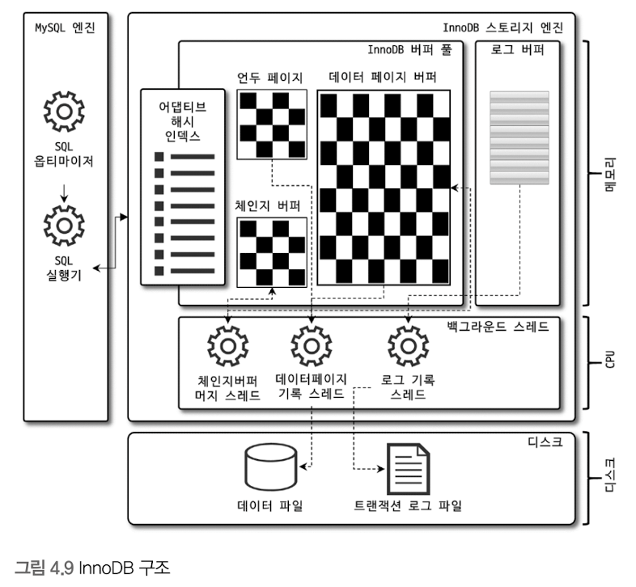
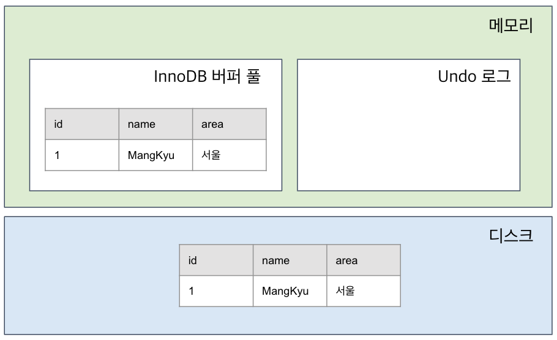
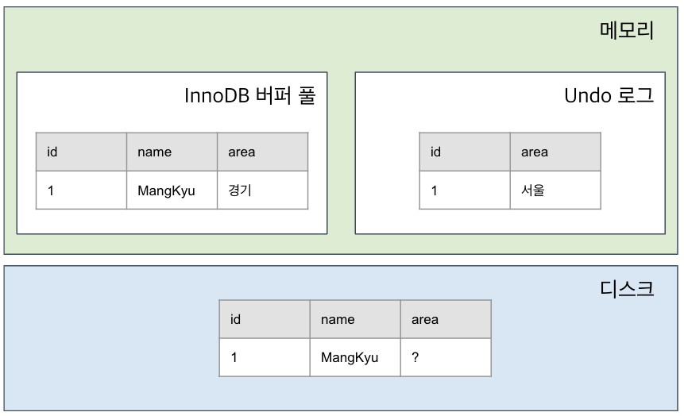
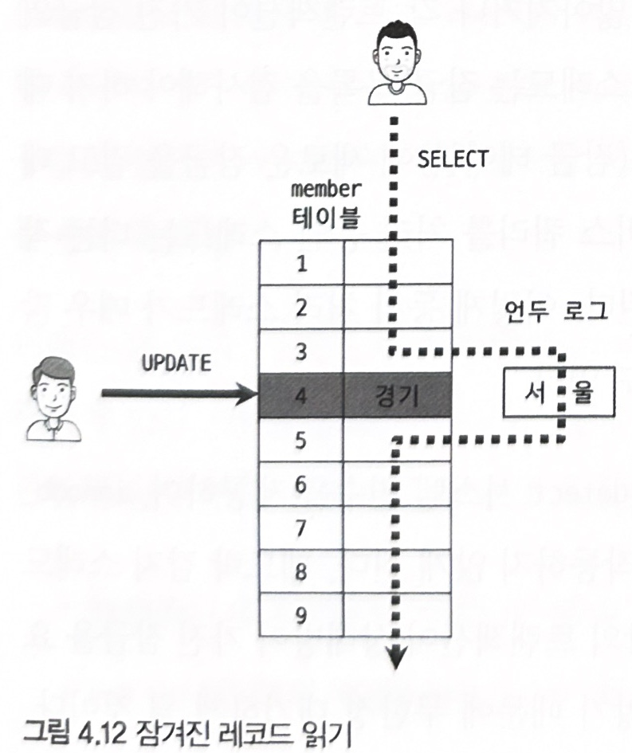
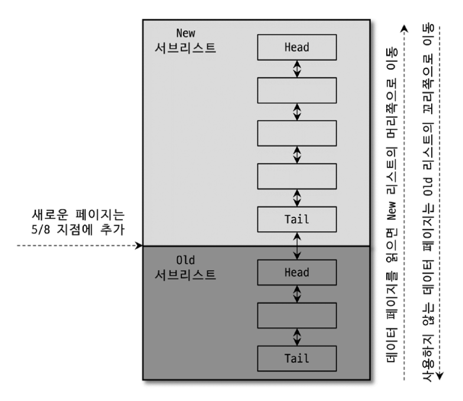
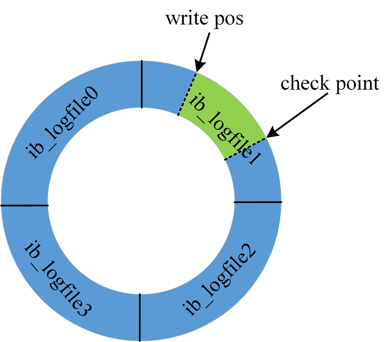

# 2주차

날짜: 2023년 1월 13일

# 4.2 InnoDB 스토리지 엔진 아키텍처

---



> **Lock(잠금)** 란?
> 
> - 동시성을 제어하기 위함
> - 여러 커넥션에서 동시에 같은 레코드나 테이블에 접근해 변경하면 결과적으로 예측할 수 없는 값이 됨.

### 특징

- 레코드 기반의 잠금 제공
    - 높은 동시성 처리 가능
    - 안정적이고 성능이 뛰어남

## 4.2.1 Primary Key에 의한 클러스터링

---

> **Clustering Index** 란? **[ p270 참조 ]**
> 
> - Primary Key 값이 비슷한 레크드끼리 묶어서 저장하는 것

### InnoDB의 테이블 특징

- Primary Key를 기준으로 클러스터링 되어 저장
    - Primary Key 값의 순서대로 디스크에 저장
    - Secondary Index는 Primary Key 값을 논리적 주소로 사용
- Primary Key를 이용한 레인지 스캔은 빠른 속도로 처리
    - 레인지 스캔 : 테이블의 일부(특정) 레코드에만 엑세스해서 읽어들임
    - [참고 사이트](https://devroach.tistory.com/40)
- Query 실행 계획에서 Primary Key가 다른 Index에 비해 비중이 높음
- 오라클 DBMS의 IOT(Index Organized Table)과 동일 구조

### MyISAM 특징과의 비교

- 클러스터링 키 지원 X
    - Primary Key와 Secondary Index의 구조적 차이 X
    - Primary Key : Unique 제약을 가진 Index
- MyISAM 테이블의 모든 인덱스는 물리적인 레크드 주소 값(ROWID)을 가짐

## 4.2.2 Foreign Key(외래키) 지원

---

> **Foreign Key(외래키)** 란?
> 
> - 두 테이블을 서로 연결하는 데 사용되는 키
>     - 부모 테이블 : 외래키 값을 제공하는 테이블
>     - 자식 테이블 : 외래키가 포함된 테이블

> **Dead Lock(데드락)** 이란?
> 
> - 여러 개의 Transaction(트랜잭션)들이 실행을 하지 못하고 서로 무한정 기다리는 상태
>     - [트랜잭션 참고](https://code-lab1.tistory.com/51)
>     - [데드락 참고](https://parkmuhyeun.github.io/etc/database/2022-07-03-Deadlock/)
>     - [잠금 참고](https://velog.io/@fortice/MySQL-%ED%8A%B8%EB%9E%9C%EC%9E%AD%EC%85%98-%EC%9E%A0%EA%B8%88Lock)
- 부모 테이블과 자식 테이블 모두 해당 Column에 Index 생성 필요
- 변경 시, 반드시 부모 테이블이나 자식 테이블에 데이터가 있는지 확인 필요
    - 잠금이 여러 테이블로 전파되고 그로 인해 데드락 발생 가능성 있음
    - `**foreign_key_checks**` 변수 OFF : 외래키 관계에 대한 체크 작업을 일시적 멈춤

## 4.2.3 MVCC (Multi Version Concurrency Control)

---

> **Concurrency Control(동시성 제어)** 란?
> 
> - DBMS가 다수의 사용자로부터 동시에 작동하는 다중 트랜잭션의 상호간섭 작용에서 DB를 보호하는 것
> - 동시성을 제어하기 위해 DBMS에서 Lock 기능 제공
>     - 여러 사용자가 데이터를 동시에 액세스하는 것처럼 보이지만,
>     - 내부적으로는 하나씩 실행되도록 트랜잭션을 직렬화하는 것
> - 목적
>     - 실행되는 트랜잭션 수를 최대화
>     - 입력, 수정, 삭제, 검색 시 데이터의 무결성을 유지
> - 문제점
>     - 읽기 작업과 쓰기 작업이 서로 방해를 일으키기 때문에 동시성 문제가 발생
>     - 데이터 일관성에 문제가 생기는 경우도 존재
>         - Lock을 더 오래 유지하거나 테이블 레벨의 Lock 사용으로, 동시성 저하가 발생
> - [MVCC 참고](https://mangkyu.tistory.com/53)

> **Undo Log** 란?
> 
> - 실행 취소 로그 레코드의 집합
>     - 트랜잭션 실행 후 롤백 시 이전 데이터로 복구하도록 로깅 해놓은 영역
> - [언두로그 참고](https://dus815.tistory.com/entry/Mysql-Undo-Log-%EB%9E%80)

### MVCC의 목적

- 일반적으로 레코드 레벨의 트랜잭션을 지원하는 DBMS가 제공하는 기능
- 잠금을 사용하지 않는 일관된 읽기 제공
    - InnoDB : Undo Log(언두로그)로 기능 구현
- Multi Version : 하나의 레코드에 대해 여러 개의 버전이 동시에 관리됨을 의미
    - INSERT : 버퍼 풀 저장 - 디스크 저장
    - UPDATE : 변경 전 데이터 언두 로그 저장 - 버퍼 풀 수정 - 디스크 수정
    - 이후 SELECT : 격리 수준에 따라 버퍼 풀 or 언두 로그의 데이터를 불러오게 됨
        - `READ_UNCOMMITTED` / `READ_COMMITED`나 그 이상
- 즉, 하나의 레코드에 2개의 버전이 유지 → 필요에 따라 표시되는 데이터가 다름

```sql
Table(member){ id(PR), name, area } : { 12, 'MangKyu', '서울' }
...
(InnoDB) mysql> UPDATE member SET m_area='경기' WHERE m_id=12;

// Update 내용에 Commit을 안하면 SELECT는 어떤 데이터를 보여주게 되는가?
(InnoDB) mysql> SELECT * FROM member WHERE m_id=12;
```





## 4.2.4 Non-Locking Consistent Read (잠금 없는 일관된 읽기)

---



- MVCC 기술을 이용해 잠금을 걸지 않고 읽기 작업 수행
    - 다른 트랜잭션이 가지고 있는 잠금을 기다리지 않고, 읽기 작업 가능
- 격리 수준이 `READ_UNCOMMITTED`나 `READ_COMMITTED`, `REPEATABLE_READ` 수준이라면,
    - `INSERT`와 연결되지 않은 순수한 읽기(`SELECT`) 작업은 다른 트랜잭션의 변경 작업과 관계없이 항상 잠금을 대기하지 않고 바로 실행
- 특정 사용자가 레코드를 변경하고 아직 커밋을 수행하지 않았다 하더라도 이 변경 트랜잭션이 다른 사용자의 SELECT 작업을 방해하지 않는다
- 변경되기 전의 데이터를 읽기 위해 언두 로그 사용
- 오랜 시간동안 활성 상태인 트랙잭션으로 인한 MySQL 서버 느림 또는 문제 발생 있음
    - 언두 로그 삭제를 못하고 유지로 인한 문제
    - 롤백 또는 커밋을 통해 트랜잭션을 빠르게 완료하도록 하는게 좋다

## 4.2.5 자동 데드락 감지

---

- 데드락 감지 스레드가 주기적으로 잠금 대기 그래프를 검사
    - 교착 상태에 빠진 트랜잭션들을 찾아 그중 하나를 강제 종료
    - 내부적으로 잠금이 교착상태에 빠지지 않았는지 체크
    - 잠금 대기 목록을 그래프(Wait-for List)형태로 관리
- 강제 종료 판단 기준 : Undo Log의 양
    - 언두 로그 레코드를 더 적게 가진 트랜잭션이 일반적으로 롤백의 대상
    - 언두 로그 레코드를 적게 가지면 롤백을 해도 언두 처리를 해야할 내용이 적다는 뜻
    - 강제 롤백으로 인한 서버 부하도 덜 유발
- MySQL 엔진에서 관리되는 테이블 잠금은 데드락 감지가 불확실해질 수 있음
    - `innodb_table_locks`시스템 변수를 활성화하면 감지 가능
- 동시 처리 스레드가 많거나, 트랜잭션들의 잠금이 많아지면 데드락 감지 스레드가 느려짐
    - 데드락 감지 스레드가 잠금 목록이 저장된 리스트에 새로운 잠금을 걸어 상태 변경을 막는데, 이에 데드락 감지 스레드가 느려지면 서비스 쿼리를 처리 중인 스레드가 작업 불가
    - `innodb_deadlock_detect` : 데드락 감지 활성화/비활성화
        - 적절히 비활성화하여 CPU 자원 소모를 줄이자
    - `innodb_lock_wait_timeout` : 데드락 상황에 일정 시간(초)이 지나면 에러 메시지 반환

## 4.2.6 자동화된 장애 복구

---

- InnoDB 데이터 파일은 기본적으로 MySQL서버가 시작될 때 항상 자동 복구 수행
    - 이 때 복구될 수 없는 손상이 있으면 서버 종료
    - `innodb_force_recovery` : 복구 옵션에 대한 변수 (설정값 : 1~6)
- 복구 옵션
    - 1(SRV_FORCE_IGNORE_CORRUPT)
        - 손상된 데이터가 발견되도 무시하고 MySQL 서버를 시작
    - 2(SRV_FORCE_NO_BACKGROUND)
        - 백그라운드 메인 스레드를 시작하지 않고 MySQL 서버를 시작
    - 3(SRV_FORCE_NO_TRX_UNDO)
        - MySQL 서버가 시작할때 이전에 완료되지 않은 트랜잭션 복구 작업을 동작하지 않게함
    - 4(SRV_FORCE_NO_IBUF_MERGE)
        - Insert Buffer 내용을 무시하고 MySQL 서버를 시작
    - 5(SRV_FORCE_NO_UNDO_LOG_SCAN)
        - Undo log 를 무시하고 MySQL 서버를 시작
    - 6(SRV_FORCE_NO_LOG_REDO)
        - Redo log 를 무시하고 MySQL 서버를 시작

## 4.2.7 InnoDB 버퍼 풀

---

### Buffer Pool

- 디스크의 데이터 파일이나 인덱스 정보를 메모리에 캐시해 두는 공간
    - 쓰기 작업을 지연시켜 일괄 작업으로 처리 가능하도록 함
    - INSERT, UPDATE, DELETE처럼 데이터를 변경하는 쿼리는 랜덤한 디스크 작업 발생
        - Buffer Pool은 이러한 변경 데이터를 모아서 처리 → 랜덤한 디스크 작업 횟수 하락

### 버퍼 풀의 크기 설정

- 운영체제와 각 클라이언트 스레드가 사용할 메모리를 충분히 고려해 설정
    - 8GB 미만 : 50% 정도만 InnoDB 버퍼 풀 크기로 설정하고, 조금씩 올리면서 최적점을 찾기
    - 50GB 이상 : 20~35GB 정도를 InnoDB 버퍼 풀 크기로 설정
- Record Buffer(레코드 버퍼)
    - 각 클라이언트 세션에서 테이블 레코드를 읽고 쓸 때 버퍼로 사용하는 공간
    - 커넥션과 사용하는 테이블이 많다면 레코드 버퍼 용도로 사용되는 메모리 공간이 많이 필요
    - ~~MySQL 서버가 사용하는 레코드 버퍼 공간은 별도로 설정할 수 없음~~
    - 전체 커넥션 개수와 각 커넥션에서 읽고 쓰는 테이블 개수에 따라 결정
    - 동적으로 해제 가능
- InnoDB 버퍼 풀의 크기를 동적으로 조절 가능(MySQL 5.7 이후)
    - `innodb_buffer_pool_size`  : 버퍼 풀 크기 설정 (128MB 단위 처리)
    - `innodb_buffer_pool_instances` : 버퍼 풀을 여러 개로 분리해 할당

### 버퍼 풀의 구조

- 버퍼 풀은 디스크에서 데이터 페이지를 읽고, 공간을 페이지 단위로 쪼개어 저장
- 버퍼 풀의 페이지 크기 조각 관리를 위한 자료구조 (3개)
    - LRU(Least Recently Used) 리스트
    - Flush(플러시) 리스트
    - Free(프리) 리스트
        - 비어 있는 페이지 목록, 새롭게 데이터 페이지를 읽어와야 할 때 사용

**LRU 리스트**

> **Page(페이지)** 란?
> 
> - 디스크에 데이터를 저장하는 가장 기본 단위 (16KB 고정)



- LRU와 MRU(Most Recently Used) 리스트가 결합된 형태
    - LRU : 가장 오래 전 사용된 페이지 리스트 `**Old 서브리스트**`
    - MRU : 가장 최근에 사용된 페이지 리스트 `**New 서브리스트**`
    - 버퍼 풀에서 자주 사용되는 페이지는 상위로, 자주 사용되지 않는 페이지는 하위로 이동
- LRU 리스트 관리 목적
    - 디스크 읽기 최소화
        - 디스크로부터 한 번 읽어온 페이지를 최대한 오랫동안 버퍼 풀의 메모리에 유지
- LRU 과정
    1. 필요한 레코드가 저장된 데이터 페이지가 버퍼 풀에 있는지 검사
    2. 디스크에서 필요한 데이터 페이지를 버퍼 풀에 적재, 적재된 페이지에 대한 포인터를 LRU 헤더에 추가
    3. 버퍼 풀의 LRU 헤더에 적재된 데이터 페이지가 실제로 읽히면 MRU 헤더로 이동
    4. 버퍼 풀에 상주하는 데이터 페이지는 사용자 쿼리의 최근 접근 빈도에 따라 나이 부여
        1. 버퍼 풀에 상주하지만 쿼리에서 오랫동안 사용되지 않은 데이터 페이지는 나이가 오래됨
        2. 결국 해당 페이지는 버퍼 풀에서 제거
        3. 쿼리에 의해 사용된 데이터 페이지는 나이가 초기화되어 MRU 헤더로 이동
    5. 필요한 데이터가 자주 접근됐다면 해당 페이지의 인덱스 키를 어댑티브 해시 인덱스에 추가

**Flush 리스트**

- 디스크에 동기화 되지 않은 데이터를 가진 페이지의 변경 시점 기준의 페이지 목록을 관리
    - 지연 쓰기로 인해 UPDATE 쿼리 실행 시 발생한 변경사항이 디스크에 즉시 반영이 안됨
- 한 번 변경 된 데이터 페이지는 플러시 리스트에서 관리
    - 특정 시점 후, 디스크로 기록됨
- 데이터가 변경되면 변경 내용을 리두 로그에 기록
    - 버퍼 풀의 데이터 페이지에도 변경 내용 반영
    - 리두 로그의 각 엔트리는 특정 데이터 페이지와 연결
    - 둘이 불일치 하면, 체크포인트를 발생
        - 디스크의 리두 로그와 데이터페이지의 상태를 동기화함.
        - 체크포인트 : 리두 로그의 어느 부분부터 복구를 실행할 지 판단 기준

### 버퍼 풀과 Redo Log(리두 로그)

> **Redo Log** 란?
> 
> - DB에 생긴 변경 이력을 기록해놓은 파일
> - 만약 데이터베이스가 깨어질 경우, 리두 로그에 남겨진 기록을 이용하여 원래 상태로 복구
> - [Redo Log 참고](https://ko.wikipedia.org/wiki/%EB%A6%AC%EB%91%90_%EB%A1%9C%EA%B7%B8)



- 버퍼 풀에는 Clean Page와 Dirty Page가 존재
    - Clean Page(클린 페이지) : 디스크에서 읽은 상태로 전혀 변경되지 않은 페이지
    - Dirty Page(더티 페이지) : INSERT, UPDATE, DELETE 명령으로 변경된 데이터를 가진 페이지
- 더티 페이지는 디스크와 메모리의 데이터 상태가 다르므로 언젠가는 디스크로 기록되야함
    - 단, 무한정 대기할 수 없으므로 리두 로그를 통해 관리
- 리두 로그는 하나의 고정 크기의 파일을 순환 형태로 연결해서 사용
    - 어느 순간 사용중인 공간을 덮어 쓸 수 있기 때문에 구분이 필요
        - 재사용 가능 공간, 당장 재사용 불가능한 공간
        - 재사용 불가능한 공간 :  Active Redo Log(활성 리두 로그)
- LSN(LogSequence Number)
    - 하나의 파일을 순환하면서 재사용되지만, 로그 포지션은 계속 증가
    - 활성 리두 로그 공간의 시작점
        - 데이터를 디스크에 기록 시, 가장 최근 체크포인터 시점의 LSN
    - Checkpoint Age(체크포인트 에이지)
        - 가장 최근 체크포인트의 LSN과 마지막 리두 로그 엔트리의 LSN의 차이
        - 활성 리두 공간의 크기
- 체크포인트의 LSN보다 작은 리두 로그 엔트리와 관련된 더티 페이지들을 디스크에 동기화

### Buffer Pool Flush(버퍼 풀 플러시)

**Flush(플러시)**

> 변경 사항을 DB파일에 기록하기 위해, 메모리 또는 임시 디스크 스토리지 영역에 버퍼하는 것
> 
- 버퍼 풀에서 더티 페이지들을 성능상 악영향 없이 디스크에 동기화를 위한 기능
    - Flush_list Flush(플러시 리스트 플러시)
    - LRU_list Flush(LRU 리스트 플러시)

**Flush_list Flush(플러시 리스트 플러시)**

- 오래된 리두 로그 공간을 지우기 위해서는 더티 페이지가 디스크와 동기화 되야함
- 플러시 리스트 플러시 함수 호출
    - 플러시 리스트에서 오래전에 변경된 데이터 페이지 순서대로 디스크에 동기화
    - 시스템 변수 제공
- Cleaner Thread(클리너 스레드)
    - 더티 페이지를 디스크로 동기화 하는 스레드
    - `innodb_page_cleaners` : 클리너 스레드의 개수 조절
    - `innodb_buffer_pool_instances`와 동일한 값으로 한다.
        - 하나의 클리너 스레드가 하나의 버퍼 풀 인스턴스를 처리하도록 설정하면 좋음
- 더티 페이지와 클린 페이지의 비율 조정
    - `innodb_max_dirty_pages_pct` : 더티 페이지와 클린 페이지의 비율을 정함 (기본값이 좋음)
        - 많은 더티 페이지를 가지면 버퍼링이 효율은 좋아짐
        - 하지만, 한번에 디스크 쓰기를 하면 디스크 쓰기 폭발이 발생할 수 있음
    - `innodb_max_dirty_pages_pct_lwm` : 기준 이상 더티 페이지 발생 → 조금씩 디스크로 기록
- DB서버에서 디스크 읽고 쓰기가 가능한 정도 설정
    - 디스크 읽고 쓰기 : 백그라운드 스레드가 수행하는 디스크 작업 (버퍼 풀의 더티 페이지 쓰기)
    - `innodb_io_capacity` : 일반 상황에서 디스크가 적절히 처리할 수 있는 수준의 값 설정
    - `innodb_io_capacity_max` : 디스크가 최대 성능을 발휘할 때 Read/Write 처리 수준 값 설정
- Adaptive Flush(어댑티브 플러시)
    - 더티 페이지 처리를 위해 DB가 적절한 알고리즘으로 처리
        - 리두 로그의 증가 속도를 분석
        - 적절한 수준의 더티 페이지가 버퍼 풀에 유지될 수 있도록 디스크 쓰기 실행
    - `innodb_adaptive_flushing` : 활성화/비활성화 기준
    - `innodb_adaptive_flushing_lwm` (기본값 : 10%)
        - 전체 리두 로그 공간 中 활성 리두 로그 공간이 설정값 이상이면 알고리즘 실행
- `innodb_flush_neighbor`
    - 더티 페이지와 디스크 동기화 때 발생
    - 디스크에서 근접한 페이지 중 더티 페이지가 있다면 함께 묶어서 디스크로 기록하는 기능

**LRU 리스트 플러시**

- LRU 리스트에서 사용 빈도가 낮은 데이터 페이지 제거를 통해 새로운 페이지 읽을 공간 창조
- `innodb_lru_scan_depth` : LRU 리스트 끝부터 해당 기준까지 페이지 스캔
- 스캔된 더티 페이지는 디스크에 동기화
- 클린 페이지는 즉시 프리 리스트로 이전

### 버퍼 풀 상태 백업 및 복구

- Warming Up(워밍업)
    - 디스크의 데이터가 버퍼 풀에 적재돼 있는 상태
    - 워밍업이 된 상태와 안 된 상태는 몇십 배의 쿼리 처리 속도가 남
- 버퍼 풀에 캐시를 통해 쿼리들의 속도를 향상시킴
    - 서버 재시작 시 버퍼 풀이 날라가 속도가 느려짐
    - 기존에는 워밍업이란 작업으로 서비스 전 임의로 버퍼 풀에 캐시해줌
    - MySQL 5.6 이후, 버퍼풀 백업 및 복구를 통해 해결
- 코드

```sql
// 서버 셧다운 전, 버퍼 풀 상태 백업
mysql> SET GLOBAL innodb_buffer_pool_dump_now=ON;
...
// 서버 재시작 후, 백업된 버퍼 풀 상태 복구
mysql> SET GLOBAL innodb_buffer_pool_load_now=ON;
...
// 버퍼 풀 복구 상태 확인
mysql> SHOW STATUS LIKE 'Innodb_buffer_pool_dump_status'\G
...
// 버퍼 풀 복구 작업이 오래 걸려서 중간에 멈추기 위한 방법
mysql> SET GLOBAL innodb_buffer_pool_load_abort=ON;
```

### 버퍼 풀의 적재 내용 확인

- MySQL 5.6 이후
    - 버퍼 풀의 메모리에 어떤 테이블의 페이지들이 적재돼 있는지 확인 방법
        - MySQL 서버의 information_schema DB의 innodb_buffer_page 테이블 이용
    - 하지만 버퍼 풀이 큰 경우, 테이블 조회에 상당히 큰 부하를 일으킴 → 느려짐
- MySQL 8.0 이후
    - information_schema DB에 innodb_cached_indexes 테이블 새로 추가
    - 테이블의 인덱스 별로 데이터 페이지가 얼마나 버퍼 풀에 적재돼 있는지 확인 가능

```sql
mysql>
SELECT
	it.name table_name,
	ii.name index_name,
	ici.n_cached_pages n_cached_pages
FROM information_schema.innodb_tables it
	INNER JOIN information_schema.innodb_indexes ii ON ii.table_id=it.table_id
	INNER JOIN information_schema.innodb_cached_indexes ici ON ici.index_id=ii.index_id
WHERE it.name=CONCAT('employees','/','employees')
```