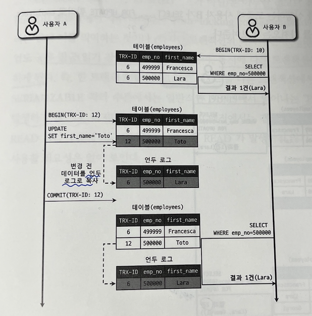

# 3주차

날짜: 2023년 1월 29일

# 5.1 트랜잭션

---

> **Transaction(트랜잭션)의 4가지 성질 (ACID)**
> 
> - **Atomicity(원자성)**
>     - all or nothing
>     - 트랜잭션의 모든 연산들이 정상 완료되거나 어떠한 연산도 수행되지 않은 상태를 보장
> - **Consistency(일관성)**
>     - 공적으로 수행된 트랜잭션은 정당한 데이터들이 데이터베이스에 반영되었음을 의미
>     - DB에서 데이터 변경 시 사전에 설정되어 있는 룰에 맞지 않는 데이터가 들어가는 것을 방지
> - **Isolation(독립성/고립성)**
>     - 여러 트랜잭션이 동시에 수행 되더라도 각각의 트랜잭션은 다른 트랜잭션의 수행에 영향을 받지 않고 독립적으로 수행되어야 함
>     - 다수의 세션 또는 유저가 같은 시간에 같은 데이터에 접근하고 처리 중일 때 수행 중인 트랜잭션이 완료 될 때 까지 다른 트랜잭션이 끼어 들지 못하게 함으로써 데이터의 누락이나 잘못된 데이터에 대한 방지
> - **Durability(지속성)**
>     - 트랜잭션이 성공적으로 완료되어 커밋되었다면, 해당 트랜잭션에 의한 반영된 모든 변경은 향후에 어떤 소프트웨어나 하드웨어 장애가 발생 되더라도 보존되어야 함

## 5.1.1 MySQL에서의 트랜잭션

---

### **Transaction(트랜잭션)**

- 작업의 완전성을 보장해 주는 것
- 논리적인 작업 셋을 모두 완벽하게 처리해야함
    - 완벽하게 처리하지 못한다면, 원 상태로 복구해야함
    - 일부만 적용되는 현상(Partial update)이 발생하지 않아야함
- 쿼리의 개수와 관계없이 논리적인 작업 자체가 100% 또는 0% 적용되야함
    - 100% : COMMIT 실행 시
    - 0% : ROLLBACK 시
- 스토리지 엔진에 따른 트랜잭션 오류 시, 실행 결과
    - MyISAM : 트랜잭션의 오류에도 부분 업데이트 실행 → **데이터 정합성(모순 없이 일치함) 문제**
    - InnoDB : 트랜잭션에 일부라도 오류 시, 복구

```jsx
mysql> create table tb_tab_myisam(col int primary key) ENGINE=MyISAM;
mysql> insert into tb_tab_myisam values (3);

mysql> create table tb_tab_innodb(col int primary key) ENGINE=InnoDB;
mysql> insert into tb_tab_innodb values (3);

mysql> insert into tb_tab_myisam values(1),(2),(3);
Error Code: 1062. Duplicate entry '3' for key 'tb_tab_myisam.PRIMARY'

mysql> insert into tb_tab_innodb values(1),(2),(3);
Error Code: 1062. Duplicate entry '3' for key 'tb_tab_innodb.PRIMARY'

-- MyISAM
mysql> select * from tb_tab_myisam;
+-----+
| col |
+-----+
|   1 |
|   2 |
|   3 |
+-----+

-- InnoDB
mysql> select * from tb_tab_innodb;
+-----+
| col |
+-----+
|   3 |
+-----+
```

## 5.2.2 주의사항

---

> 트랜잭션의 범위는 최소화하라.
> 
> - 꼭 필요한 최소의 코드에만 적용하는 것이 좋다.

<aside>
 처리시작 - > 
**트랜잭션 시작** ->사용자 로그인 여부 확인 -> 사용자 글쓰기 내용 오류 여부 확인 -> 
첨부된 파일의 업로드 가능 확장자 및 용량 확인 , 저장 -> 
**사용자 입력 내용(글 과 첨부파일 정보) 을 DB에 저장** -> 
저장 된 내용 조회 및 추가 정보 DB에서 조회 -> 게시물에 대한 알림 메일 발송 -> 
**메일 발송 이력 DB에 저장** -> **트랜잭션 종료** -> 
처리 완료

</aside>

- 트랜잭션 시작부터 종료까지 직접 DB에 저장하는 행동은 2번 밖에 없음
    - 1) 사용자 입력 내용 DB 저장, 2) 메일 발송 이력 DB 저장
    - 위 2개의 행동에만 트랜잭션을 시작 및 종료하면 문제를 피할 수 있다.
- **외부 로직의 문제로 장시간 소요될 경우,** 전체적인 처리가 매우 늦어지거나 문제 가능성 높음
    - 특히 ,네트워크 작업이 있는 경우 반드시 트랜잭션에서 배제
    - DBMS 서버가 높은 부하상태로 빠지거나 위험한 상태로 빠질 가능성 높음

# 5.2 MySQL 엔진의 잠금

---

- 잠금의 레벨
    - MySQL 레벨의 잠금
        - 모든 스토리지 엔진에 영향을 미침
        - 테이블 락 외에도 메타데이터 락(테이블 구조 잠금), 네임드 락 등 기능 제공
    - 스토리지 엔진 레벨의 잠금
        - 스토리지 엔진 간 상호 영향 없음

## 5.2.1 Global Lock(글로벌 락)

---

> **DML(Data Manipulation Language, 데이터 조작어)**란?
> 
> - 정의된 데이터베이스에 입력된 레코드를 조회, 수정, 삭제 등의 역할을 하는 언어
> - SELECT INSERT UPDATE DELETE

> **DDL(Data Definition Language, 데이터 정의어)**란?
> 
> - 데이터베이스를 정의하는 언어 (데이터 전체의 골격을 결정)
> - CREATE ALTER DROP TRUNCATE
- `FLUSH TABLES WITH READ LOCK` 명령으로 획득
- MySQL에서 제공하는 잠금 가운데 가장 범위가 큼
- 한 세션에서 글로벌 락 획득 시,
    - 다른 세션에서 SELECT를 제외한 대부분의 DDL, DML 문장 실행이 대기상태로 남음
- 글로벌 락의 영향 범위 : MySQL 서버 전체
    - 작업 대상 테이블이나 DB가 다르더라도 동일하게 영향
- MySQL 8.0 이후
    - InnoDB 기본 스트리지 엔진 채택
    - Backup Lock(백업 락) 도입
        - Xtrabackup이나 Enterprise Backup과 같은 백업 툴들의 안정적 실행을 위한 백업 락 도입
    - 코드
    
    ```sql
    mysql> LOCK INSTANCE FOR BACKUP;
    -- // 백업 실행
    mysql> UNLOCK INSTANCE;
    ```
    
    - 특정 세션에서 백업 락 획득 시, 모든 세션에서 다음 정보는 변경 불가
        - 데이터베이스 및 테이블 들 모든 객체 생성 및 변경, 삭제
        - REPAIR TABLE과 OPTIMIZE TABLE 명령
        - 사용자 관리 및 비밀번호 변경
    - 하지만 일반적인 테이블의 데이터 변경은 허용
    - 백업의 실패를 막기 위해서 DDL 명령이 실행되면 복제를 일시 중지하는 역할

## 5.2.2 Table Lock(테이블 락)

---

- 개별 테이블 단위로 설정되는 잠금
- 명시적 또는 묵시적으로 특정 테이블 락 획득 가능
- 명시적으로 획득한 테이블 락
    - `LOCK TABLES table_name [READ | WRITE]` 명령으로 특정 테이블 락 획득
    - `UNLOCK TABLES` : 잠금 반납(해제)
    - 글로벌 락과 동일하게 온라인 작업에 상당한 영향을 미침
- 묵시적인 테이블 락
    - 쿼리가 실행되는 동안 자동으로 획득됐다가 쿼리가 완료되고 자동 해제
    - 하지만 InnoDB 테이블은 스토리지 엔진 차원에서 레코드 기반의 잠금 제공
        - 단순 데이터 변경 쿼리로 인해 묵시적인 테이블 락이 설정되지 않음
        - 테이블 락이 설정은 되지만 DDL의 경우에만 영향

## 5.2.3 Named Lock(네임드 락)

---

- 단순히 사용자가 지정한 **문자열**에 대해 획득하고 반납하는 잠금
- 사용처
    - 여러 클라이언트가 상호 동기화를 처리해야 하는 경우
    - 많은 레코드에 대해 복잡한 요건으로 레코드를 변경하는 트랜잭션일 경우
- MySQL 8.0 이후, 네임드 락 중첩 사용 가능
    - 한 번에 락 해제도 가능
- 코드

```jsx
// mylock 이라는 문자열 잠금 관련 코드
mysql> SELECT GET_LOCK('mylock', 2); // 잠금 사용중일 경우, 2초 대기
mysql> SELECT IS_FREE_LOCK('mylock'); // 해당 문자열의 잠금 설정 확인
mysql> SELECT RELEASE_LOCK('mylock'); // 잠금 반납(해제)
// 2개 이상의 네임드 락 사용 가능 (MySQL 8.0 이후)
mysql> SELECT GET_LOCK('mylock_1', 10);
mysql> SELECT GET_LOCK('mylock_2', 10);
mysql> SELECT RELEASE_ALL_LOCK();  // 모든 네임드 락 해제
```

## 5.2.4 Metadata Lock(메타데이터 락)

---

- 데이터베이스 객체(테이블, 뷰 등)의 이름이나 구조를 변경하는 경우에 잠금 획득
    - 명시적으로 획득하거나 해제 할 수 있는 것이 아님
    - RENAME TABLE 명령과 같이 테이블 이름 변경 시, 자동 획득
    - RENAME TABLE 명령은 원본 이름과 변경 이름 모두 잠금 설정
- 한 세션에서 트랜잭션을 명시적으로 시작하고 데이터를 조회 중
    - 다른 세션에서 테이블의 구조를 변경하게 되면 Metadata Lock 으로 대기를 하게 됩니다.

```sql
-- Session 1
select CONNECTION_ID();
+-----------------+
| CONNECTION_ID() |
+-----------------+
|               4 |
+-----------------+
<-- Session 1의 Process ID 는 4 로 확인됨

-- 트랜잭션 시작
mysql> start transaction;
Query OK, 0 rows affected (0.00 sec)

mysql> select * from user_info;
+----+------+
| id | name |
+----+------+
|  1 | jade |
|  2 | Tom  |
+----+------+
2 rows in set (0.00 sec)

-- Session 2 : 컬럼 추가 시도
mysql> alter table user_info add column col2 varchar(100);
<!!--- 락 획득 실패 및 락에 의해 대기중

-- Session 1 : Full processlist
mysql> show full processlist;
+----+------------+------+------+---------------------------------+----------------------------------------------------+
| Id | User       | db   | Time | State                           | Info                                               |
+----+------------+------+------+---------------------------------+----------------------------------------------------+
|  2 | system user| NULL | 1321 | Connecting to master            | NULL                                               |
|  4 | root       | npm  |    0 | starting                        | show full processlist                              |
|  8 | root       | npm  |   10 | Waiting for table metadata lock | alter table user_info add column col2 varchar(100) |
+----+------------+------+------+---------------------------------+----------------------------------------------------+
<!!-- Metadata lock 에 의해 Session 2가 대기 하는 상황
```

## 참고사이트

---

- MySQL 트랜잭션과 잠금 참고

[MySQL - 트랜잭션 과 잠금 (1) - Real MySQL 8.0](https://hoing.io/archives/4182)

- DDL, DML, DCL 용어 참고

[DDL, DML, DCL 이란?](https://velog.io/@ksk5401/DDL-DML-DCL-%EC%9D%B4%EB%9E%80)

# 5.3 InnoDB 스토리지 엔진 잠금

InnoDB 스토리지 엔진은 MySQL과 별개로 잠금을 제공한다.

<aside>
💡 스토리지 엔진 내부에서 레코드 기반의 잠금 방식을 탑재하고 있다.

</aside>

## 5.3.1 InnoDB 스토리지 엔진의 잠금

InnoDB 스토리지 엔진은 `레코드 기반의 잠금` 을 제공하며, 잠금 정보가 상당히 작은 공간으로 관리되기 때문에 *락 에스컬레이션(레코드 락이 페이지 락으로, 또는 테이블 락으로 레벨업되는 경우)되는 경우는 없다.

또한 InnoDB에서는 특징인 레코드와 레코드 사이의 간격을 잠그는 `갭(GAP) 락`이라는 것이 존재한다.



점선으로 표시된 것은 존재하지 않는 레코드를 뜻한다.

### 5.3.1.1 레코드 락

레코드 자체만을 잠그는 것을 *레코드 락이라고 한다.

- 레코드 ?
    
    레코드란 테이블의 한 데이터의 집합(=튜플, 행, 레코드)를 말한다.
    

<aside>
💡 다른 DBMS 레코드 락과 동일한 역할을 하지만, InnoDB 스토리지 엔진은 레코드 자체가 아니라, 
`인덱스의 레코드`를 잠근다.

</aside>

- 인덱스가 없는 테이블이라면?
    
    내부적으로 자동 생성된 인덱스의 레코드를 잠근다.
    

### 5.3.1.2 갭 락

InnoDB 스토리지 엔진에만 있는 갭 락이라는 개념이다.

갭 락은 레코드를 잠그는게 아닌, 레코드와 레코드 `사이의 그 간격(갭)`을 잠그는 것이다. 레코드와 레코드 사이의 새로운 레코드가 생성되지 않도록 하기 위함이다.

갭 락은 다음에 설명할 넥스트 키 락과 함께 쓰인다.

### 5.3.1.3 넥스트 키 락

레코드 락과 갭 락을 합쳐 놓은 형태의 잠금을 넥스트 키 락(Next Key Lock)이라고 한다.

- innodb_locks_unsafe_for_binlog 기본값: 활성화
    
    `innodb_locks_unsafe_for_binlog` 시스템 변수가 비활성화가 되면(0으로 설정) 변경을 위해 검색하는 레코드에는 **넥스트 키 락** 방식으로 잠금이 걸린다. ([공식문서](https://dev.mysql.com/doc/refman/5.7/en/innodb-parameters.html#sysvar_innodb_locks_unsafe_for_binlog)에는 Deprecated라고 표시되고, 8.0 기준으로는 해당 변수가 사라짐)
    

하지만, 넥스트 키 락의 주 목적은 소스 서버와 레플리카 서버의 데이터 일치를 위해 사용하므로 레플리카 서버를 사용하지 않는다면 굳이 사용하지 않는 것이 좋다.

아래는 `캡락, 넥스트-키 락`에 대해서 자세하게 설명해준다.

[[MySQL]MySQL 벼락치기(5) - 갭락(Gap Lock)과 넥스트 키 락(Next-Key Lock)](https://idea-sketch.tistory.com/46)

### 5.3.1.4 자동 증가 락

MySQL에서는 자동 증가하는 숫자 값을 추출(채번)하기 위해 `AUTO_INCREMENT`라는 컬럼 속성을 제공한다. 해당 값은 여러 레코드가 동시에 INSERT가 되는 경우 중복되지 않고 순서대로 증가하는 숫자를 가져야 한다.

<aside>
💡 이를 해결하기 위해 InnoDB 스토리지 엔진 내부적으로 `AUTO_INCREMENT 락` 이라고 하는 테이블 수준의 잠금을 사용한다.

</aside>

`AUTO_INCREMENT` 락은 `INSERT`와 `REPLACE` 쿼리 문장과 같이 새로운 레코드를 저장하는 쿼리에서만 필요하며, `UPDATE`, `DELETE` 쿼리에서는 걸리지 않는다.

특징으로는, 트랜잭션 관계 없이 `INSERT`나 `REPLACE` 문장에서 `AUTO_INCREMENT` 값을 가져오는 순간에만 락이 걸렸다가 즉시 해제된다. (`AUTO_INCREMENT`에 명시적으로 값을 지정해도 자동 증가 락이 걸리게 된다)

- 아주 짧은 순간에만 락이 걸렸다가 해제되는 잠금이라 문제가 되진 않지만 작동 방식을 변경할 수 있다.
    - innodb_autoinc_lock_mode=0
        - 모든 INSERT 문장은 자동 증가 락을 사용한다.
    - innodb_autoinc_lock_mode=1
        - 단순한 1건 또는 여러건의 레코드를 MySQL 서버가 레코드의 건수를 정확하게 예측할 수 있는 경우에는 자동 증가 락을 사용하지 않고 래치(뮤텍스)를 이용해 처리한다. (이하 생략…)
    - innodb_autoinc_lock_mode=2
        - 자동 증가 락을 사용하지 않고, 래치(뮤텍스)를 사용한다. 동시 처리 성능이 향상되지만, 연속된 자동 증가 값을 보장하지 않는다.

## 5.3.2 인덱스와 잠금

앞서 innoDB는 레코드를 자체를 잠그는 것이 아닌 인덱스를 잠그는 방식이라고 했다.

즉, 변경해야 할 레코드를 찾기 위해 검색한 인덱스의 레코드를 모두 락을 걸어야 한다.

예를 들어 `UPDATE 문`을 살펴보자.

- emp 테이블에는 first_name 컬럼에만 인덱스가 걸려있다.

```sql
mysql> SELECT COUNT(*) FROM emp WHERE first_name='Georgi';
+------+
|  253 |
+------+

mysql> SELECT COUNT(*) FROM emp WHERE first_name='Georgi' and last_name='Klassen';
+------+
|    1 |
+------+

mysql> UPDATE emp SET hire_date=NOW() WHERE first_name='Georgi' and last_name='Klassen';
--- 1건의 레코드 업데이트
```

과연 `단 1건`의 데이터를 변경하기 위한 UPDATE 쿼리를 실행했을 때 `락`이 걸리는 레코드는 몇개일까?

바로 253개의 레코드이다. 

<aside>
💡 왜 253개인가?
앞서 InnoDB 스토리지 엔진은 **인덱스를 잠그는 방식의 락**을 제공한다고 했다.
UPDATE 문의 WHERE 절에 쓰인 두 컬럼(first_name, last_name) 모두 인덱스가 걸려있지 않았다.
즉, first_name만 걸려있기 때문에 `first_name=’Georgi’` 레코드가 모두 잠기는 것이다.

</aside>

- 만약 인덱스가 하나도 없었다면?
    
    테이블 풀 스캔하면서 몇천..몇억개의 모든 레코드를 잠그게 된다. 
    
    이것이 바로 MySQL 만의 방식이며 InnoDB에서 인덱스 설계가 중요한 이유이다.
    
    where절에 자주 들어가는 컬럼에 인덱스를 거는 식으로 많이 사용한다. (where절에 두 컬럼이 쓰이는데 하나만 걸면 의미 없다)
    

## 5.3.3 레코드 수준의 잠금 확인 및 해제

InnoDB 스토리지 엔진의 레코드 수준 잠금은 테이블 수준 잠금보다는 조금 더 복잡하다. 테이블 잠금은 대상 테이블이 잠겼는지 쉽게 파악이 되지만, 레코드 잠금은 잘 안쓰이는 레코드가 잠기면 한참동안이나 잠겨있는 상태로 남아있는 경우가 있다. (강제로 종료하려면 KILL 명령어를 사용하자)

다음 시나리오를 보면서 잠금에 대해서 이해해보자.

```sql
connection 1:
	BEGIN;
	UPDATE emp SET hire_date=NOW() WHERE emp_no=100;
	
	connection 2:
		UPDATE emp SET hire_date=NOW() WHERE emp_no=100;

		connection 3:
			UPDATE emp SET hire_date=NOW() WHERE emp_no=100;
```

MySQL 8.0부터는 `performance_schema`의 `data_locks`와 `data_lock_waits` 테이블을 이용해 트랜잭션이 어떤 잠금을 기다리고 있는지, 기다리고 있는 잠금은 어떤 트랜잭션을 가지고 있는지 확인할 수 있다.

```sql
mysql> SHOW PROCESSLIST;
```

| id | time | state | info |
| --- | --- | --- | --- |
| 17 | 607 |  | NULL |
| 18 | 22 | updating | UPDATE emp SET hire_date=NOW() WHERE emp_no=100 |
| 19 | 21 | updating | UPDATE emp SET hire_date=NOW() WHERE emp_no=100 |
- 17번 스레드는 UPDATE를 실행 후 커밋을 하지 않은 상태이다. 여전히 잠금을 가지고 있는 상태이다.
- 18번 스레드는 17번 스레드를, 19번 스레드는 18번 스레드를 기다리고 있다.
    - 19번 스레드는 결국 17번과 18번 스레드를 기다리는 것이다.
    - 정확한 정보를 확인하기 위해서는 p.174를 참고하자.

# 5.4 MySQL의 격리 수준

트랜잭션의 격리 수준(isolation level)이란 여러 트랜잭션이 동시에 처리될 때 특정 트랜잭션이 다른 트랜잭션에서 변경하거나 조회하는 데이터를 볼 수 있게 허용할지 말지를 결정하는 것이다.

크게 4가지로 나뉜다.

1. READ UNCOMMITED (=DIRTY READ)
    - 거의 사용하지 않는다.
2. READ COMMITED
    - Oracle 같은 DBMS에서 주로 사용
3. REPEATABLE READ
    - MySQL에서 사용
4. SERIALIZABLE
    - 동시성이 중요한 데이터베이스에서는 거의 사용되지 않는다.

아래로 내려갈 수록 트랜잭션 간 데이터 격리(고립) 정도가 높아지며, 동시 처리 성능은 낮아진다.

하지만, SERIALIZABLE이 아닌 나머지 3개는 크게 성능의 개선이나 저하는 발생하지 않는다.

## 5.4.1 READ UNCOMMITED

각 트랜잭션에서의 변경 내용이 `COMMIT, ROLLBACK 여부에 상관없이` 다른 트랜잭션에서 보인다.

- A 트랜잭션에서 새로운 레코드를 추가하고 commit을 하기 전인데도 B 트랜잭션에서는 새로운 데이터를 조회할 수 있다.
- 하지만, 문제는 A 트랜잭션이 롤백이 되었을 경우이다. B 트랜잭션에서는 해당 데이터가 정상적이라 판단하고 추후 데이터 처리를 할 것이기 때문이다.

데이터가 사라졌다 보였다하는 이러한 현상을 더티 리드(Dirty read)라고 한다.

절대 사용되어선 안되는 격리 수준이다.

## 5.4.2 READ COMMITED (NON-REPEATABLE READ)

온라인 서비스에서 가장 많이 선택되는 격리 수준이다. 더티 리드 현상은 여기서 절대 발생하지 않는다.

어떤 데이터든 `COMMIT이 완료된 데이터`만 다른 트랜잭션에서 보이기 때문이다.


- COMMIT 하기 전까지는 실제 데이터를 가져오는 방식이 아닌, 언두 로그에 있는 데이터를 가져온다.
- COMMIT이 완료된 이후에는 실제 데이터를 가져오게 된다.
- 여기서 문제가 발생하게 되는데..
    - 한 트랜잭션에서 동일한 SELECT는 동일한 결과를 내야한다는 `REPEATABLE READ 정합성`에 어긋난다.

<aside>
💡 트랜잭션 내에서 실행되는 SELECT와 트랜잭션 없이 실행되는 SELECT의 차이를 혼동하지 말자.
→ READ COMMITED 격리 수준에서는 둘의 차이가 별로 없다.
→ 하지만, REAPEABLE READ 격리 수준에서는 기본적으로 SELECT 문장도 트랜잭션 범위 내에서만 작동한다.

</aside>

## 5.4.3 REPEATABLE READ

MySQL의 InnoDB 스토리지 엔진에 **기본적으로 사용되는 격리 수준**이다. 바이너리 로그를 가진 MySQL에서는 최소 `REPEATABLE READ` 격리 수준 **이상**을 사용해야 한다.

REPEATABLE READ 격리 수준에서는 다음과 같은 특징이 있다.

- READ COMMITED 격리수준에서 발생한 데이터 조회의 부정합이 발생하지 않는다.
- `MVCC(Multi Version Concurrency Control)` 을 이용해서 언두 로그에 백업한 데이터를 이용해 동일한 결과를 보장하는 것이다. (MVCC 설명은 4.2.3 절 확인)
- READ COMMITED와 차이점은 언두 영역에 백업된 레코드의 여러 버전 가운데 몇번째 이전 버전까지 찾아 들어가는지에 차이가 있다.

### 트랜잭션과 MVCC에 대해서..

모든 InnoDB의 트랜잭션은 고유한 트랜잭션 번호(순차적으로 증가하는 값)를 가진다. 언두 영역에는 백업된 모든 레코드에는 변경을 발생시킨 트랜잭션의 번호가 포함되어있다. (아래 참조)

```sql
+--------+--------+---------+
| TRX-ID | field1 | field 2 |
+--------+--------+---------+
|   6    | 10000  |  test1  |
+--------+--------+---------+
|   12   | 50000  |  test9  |
+--------+--------+---------+
```

언두 영역의 백업된 데이터는 InnoDB 스토리지 엔진이 불필요하다고 판단한 시점에 **주기적으로 삭제**를 한다.

`REPEATABLE READ` 격리 수준에서는 `MVCC`를 보장하기 위해 실행중인 트랜잭션 가운데 가장 오래된 트랜잭션 번호보다 트랜잭션 번호가 앞선 언두 영역의 데이터는 삭제할 수가 없다.

### REPEATABLE READ 작동 방식

아래 그림은 REPEATABLE READ 작동 방식을 보여준다.


1. 10번(트랜잭션)이 SELECT를 실행했다.
2. 이후 12번(트랜잭션)이 Lara → Toto로 변경을 했다.
    1. 변경되기 전 데이터는 언두로그에 백업된다.
3. 12번(트랜잭션)이 커밋을 했다.
4. 10번(트랜잭션)이 다시 Lara를 조회했다.
    1. 여기서 만약, 커밋된 데이터가 조회되면? REPEATABLE READ의 데이터 정합성에 어긋나게 된다.
    2. 사실 조회할 수도 없다. REPEATABLE READ 격리 수준에서는 ***자신의 트랜잭션 번호보다 같거나 작은 트랜잭션 번호의 데이터*** 만 볼 수 있게 된다. **(중요!)**
5. 그렇기 때문에 언두로그에 백업된 데이터를 반환하게 된다.

### PHANTOM READ (PHANTOM ROW)

<aside>
💡 팬텀 리드(또는 팬텀 로우)는 다른 트랜잭션에서 수행한 변경 작업에 의해 데이터가 보였다 안 보였다 하는 현상을 의미한다.

</aside>

아래 시나리오를 살펴보자.


1. 10번 트랜잭션이 emp_no가 50000 이상인 값을 조회하고 있다. (1건 조회)
2. 12번 트랜잭션이 50001번의 데이터를 추가하고 커밋을 했다.
3. 10번 트랜잭션이 똑같이 SELECT를 했다.
    1. 이때 원래 같았으면 언두로그에 있는 값을 가져와서 이전처럼 1건의 데이터만 조회해와야 한다. 하지만 12번 트랜잭션이 추가한 데이터까지 총 2개의 조회 결과가 반환이 된다.

왜 이런 상황이 발생할까?

<aside>
💡 SELECT … FOR UPDATE란?

단순 SELECT가 아닌, 데이터를 변경하기 위한 조회를 한다고 명시하는 것이다.
그렇기 때문에 조회와 동시에 해당 레코드에 LOCK을 걸게 된다.

</aside>

언두 레코드에는 잠금을 걸 수 없다. 그렇기 때문에 `SELECT … FOR UPDATE`, `SELECT … LOCK IN SHARE MODE`로 조회되는 레코드는 언두 영역의 변경 전 데이터를 잠금할 수 없기 때문에 현재 레코드의 값(잠금 없이)을 가져오게 되는 것이다. → ***제대로 파악해서 작성하기.***

[SELECT FOR UPDATE vs LOCK IN SHARE MODE](https://velog.io/@sangmin7648/SELECT-FOR-UPDATE-vs-LOCK-IN-SHARE-MODE)

## 5.4.4 SERIALIZABLE

- 가장 단순하고 엄격한 격리 수준이다.
- 4가지 격리수준에서 동시 처리 성능이 제일 떨어진다.
- 순수한 SELECT 조회도 잠금을 걸게 된다.
    - 그렇기 때문에 PHANTOM READ가 발생하지 않게 된다.

<aside>
💡 그렇다면 PHANTOM READ 때문이라도 SERIALIZABLE 격리 수준을 택해야 할까?

→ InnoDB 스토리지 엔진에서는 갭 락, 넥스트 키 락 덕분에 REPEATABLE READ 격리 수준에서도 이미 PHANTOM READ가 *발생하지 않기 때문에 굳이 SERIALIZABLE을 사용할 필요성은 없다.

</aside>

*물론 위에서 설명한 `SELECT … FOR UPDATE`, `SELECT … LOCK IN SHARE MODE` 쿼리같이 예외적인 상황은 제외하고 말이다.