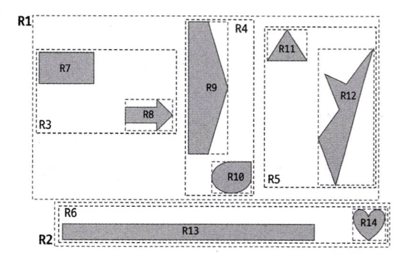
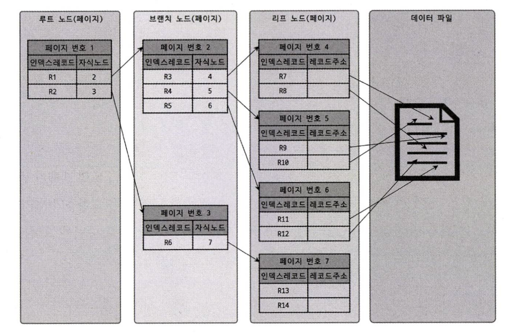
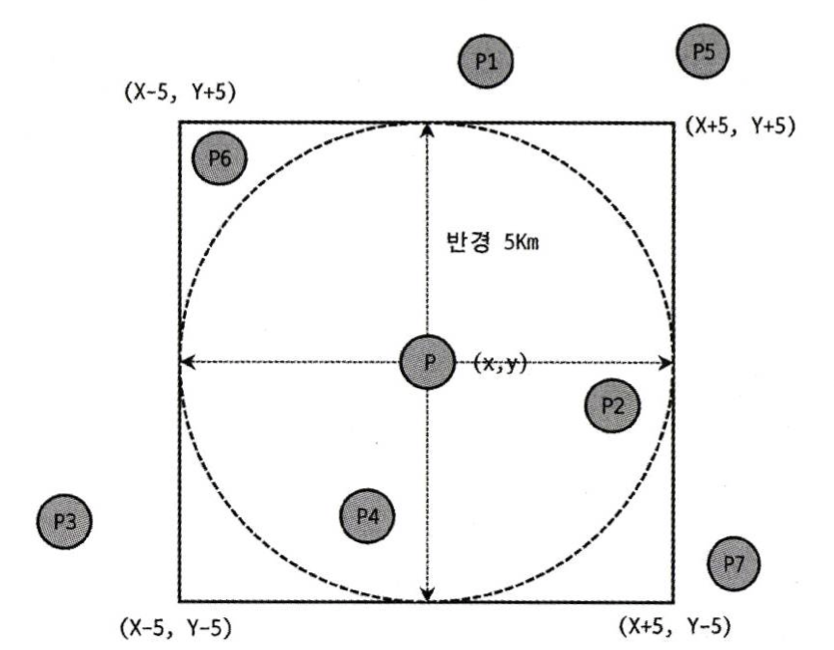
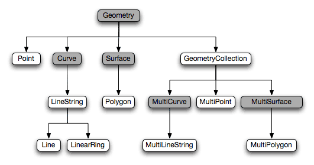
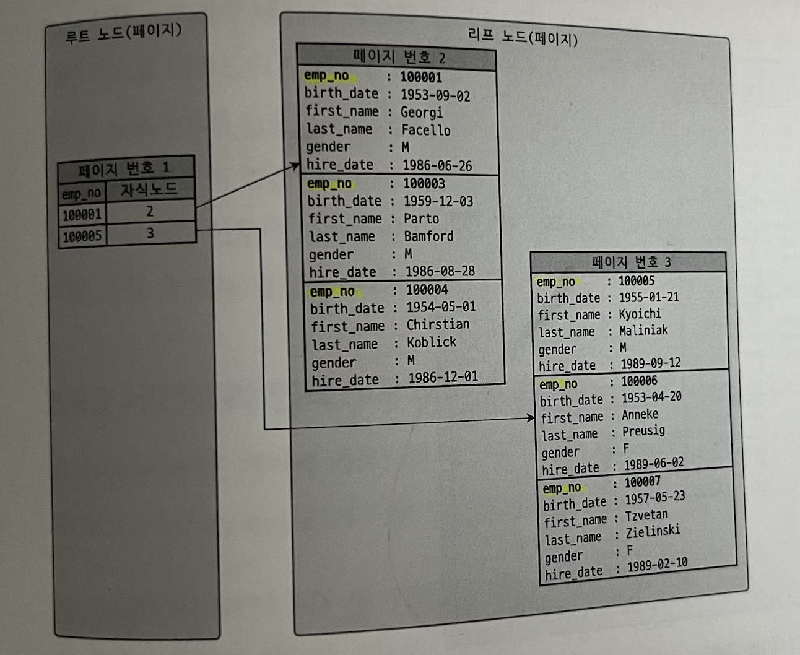

# ch8. 인덱스

# 8.1 디스크 읽기 방식

HDD vs SSD

- 순차 I/O 방식은 사실 SSD가 HDD보다 조금 빠르거나 거의 비슷한 성능을 보인다.
- 하지만, 랜덤 I/O에서는 대략 5000배 정도 빠르다.

랜덤 I/O, 순차 I/O란?

- 순차 I/O는 데이터를 디스크에 저장하기 위해 데이터를 모아서 1 번 시스템에게 요청을 한다.
    - 즉, 디스크 헤더를 1 번 움직였다.
- 랜덤 I/O는 각각의 데이터를 저장할 때마다 시스템에게 요청을 한다.
    - 즉, 디스크 헤더를 n 번 움직였다.

결국, 순차 I/O는 랜덤 I/O보다 거의 3배정도 빠르다.

<aside>
💡 디스크의 성능은 디스크 헤더의 위치 이동 없이 얼마나 많은 데이터를 한 번에 기록하느냐에 의해 결정된다고 볼 수 있다.

</aside>

> 일반적으로, 쿼리를 튜닝하는 것은 랜덤 I/O를 줄이기 위함이다.
> 

# 8.2 인덱스란?

목차와 많이 혼동을 하는데 이 둘은 전혀 다른 개념이다. ([참고](https://namu.wiki/w/목차))

아래 예시처럼, ‘찾아보기’와 같이 해당 내용을 알고싶으면  몇 페이지로 가라 지름길처럼 알려주는 것이 인덱스이다.

```sql
-ㄱ-
개 ... 5p
감나무 ... 10p
-ㄴ-
나비 ... 11p
...
```

DBMS 인덱스도 마찬가지로,

- 컬럼의 값(key)과 해당 레코드가 저장된 주소(value)의 쌍을 인덱스로 만들어 두는 것이다.
- 해당 인덱스는 ㄱ, ㄴ, ㄷ 순으로 미리 정렬해서 보관한다.
- SortedList 자료구조와 같다.

### 인덱스는..

DBMS에서 인덱스는 데이터의 저장(`INSERT, UPDATE, DELETE`) 성능을 희생하고 **읽기 속도를 높이는 기능**이다. 테이블의 인덱스를 하나 더 추가할지 말지는 저장 속도를 어디까지 희생할 수 있고, 읽기 속도를 어느 정도까지 빠르게 필요로 하는지에 따라 결정해야 한다. `WHERE` 절에 들어간다고 무조건 인덱스로 지정하면 역효과를 불러올 수 있다.

# 8.3 B-Tree 인덱스

인덱싱 알고리즘 중 가장 일반적으로 사용되는 알고리즘. B는 Binary의 약자가 아닌, Balanced의 약자이다.

## 8.3.1 구조 및 특성

### B-Tree의 구조


- 제일 상단에 있는 루트 노드, 중간에 있는 브랜치 노드, 가장 마지막에 있는 리프 노드가 있다.
    - 리프 노드는 항상 실제 데이터 레코드를 찾아가기 위한 주소값을 가지고 있다.
- 인덱스들은 모두 정렬이 된 상태로 저장이 되어 있다.
- 실제 디스크의 저장된 데이터 파일의 레코드는 정렬되어있지 않다.
    - 엄밀히 말하면, InnoDB에서는 레코드가 클러스터되어 저장되기 때문에 기본적으로 PK 순서로 정렬되어 저장된다.

### 데이터 레코드 구조 (InnoDB)


리프 노드와 데이터 파일의 구조를 자세하게 살펴보자.

데이터 파일에는 결국 PK를 저장하고 있는 B-Tree가 있다. 그렇기 때문에 인덱스를 이용해 리프노드를 찾은 다음 PK가 저장된 B-Tree 탐색을 또 해야 한다.

## 8.3.2 B-Tree 인덱스 키 추가 및 삭제

### 8.3.2.1 인덱스 키 추가

1. B-Tree에 저장될 때는 저장될 키 값을 이용해 B-Tree상의 적절한 위치를 검색해야 한다.
2. 저장될 위치가 결정되면 레코드의 키 값과 대상 레코드의 주소 정보를 B-Tree의 리프 노드에 저장한다.
3. 만약, 리프 노드가 꽉 차 더는 저장할 수 없는 경우에는 리프 노드를 분리하는 작업을 해야 한다.
    1. 이 작업은 상위 노드에까지 영향을 미친다. 이 때문에 쓰기 작업에는 비용이 많이 든다.

InnoDB 스토리지 엔진은 키 추가 작업을 *지연시켜 나중에 처리할 수 있다. 하지만 PK, 유니크 인덱스의 경우 중복 체크가 필요하기 때문에 즉시 처리 된다. (*체인지 버퍼를 이용해 지연작업을 처리한다.)

### 8.3.2.2 인덱스 키 삭제

삭제할 키 값이 저장된 리프 노드를 찾아 삭제 마크만 하면 작업이 끝난다. 삭제 마킹된 인덱스 키 공간은 그대로 방치 되거나 재활용할 수 있다. 마킹 작업 또한 디스크 쓰기가 필요하다. InnoDB 스토리지 엔진에서는 이 작업이 버퍼링되어 지연 처리될 수도 있다.

### 8.3.2.3 인덱스 키 변경

인덱스 키 값에 따라 저장되는 리프 노드의 위치가 결정되므로 단순하게 변경할 수 없다. 그렇기 때문에 `1. 먼저 키를 삭제한 뒤` → `2. 새롭게 추가를 한다`

이 작업 역시 InnoDB 스토리지 엔진이 체인지 버퍼를 활용해 지연 처리될 수 있다.

### 8.3.2.4 인덱스 키 검색

인덱스는 조회를 빠르게 하기 위한 목적이다. 하지만 주의를 해야 할 점들이 있다.

- LIKE 조건일 경우 “A%” 경우는 가능하나, “%B”의 경우는 불가능 하다.
- 100% 일치 조건은 가능
- 부등호(<, >) 조건 가능
- 키 값이 변형되면 불가능
    - ex) `where substr(name, 1) = ‘A’`

인덱스 설계가 중요한 또 다른 이유는 InnoDB 스토리지 엔진에서의 레코드 잠금은 결국 인덱스 레코드를 먼저 잠근 후 테이블의 레코드를 잠그는 방식이기 때문에, 최대한 적은 레코드를 잠그도록 해야 한다.

## 8.3.3 B-Tree 인덱스 사용에 영향을 미치는 요소

### 1. 인덱스 키 값의 크기

디스크에 데이터를 저장하는 가장 기본 단위를 `페이지`라고 한다.

B-Tree는 자식 노드의 개수는 가변적이다. 페이지 크기와 키 값의 크기에 따라 결정되는데, MySQL의 페이지 크기 기본값이 16KB이고 자식 노드 주소 영역이 대략 12바이트라고 가정하면 하나의 인덱스 페이지(16KB)에 `16*1024/(16+12) = 585`개를 저장할 수 있다. 최종적으로 자식 노드를 585개 가질 수 있는 B-Tree가 되는 것이다.

만약 인덱스 키 값이 32바이트로 늘어났다면, `16*1024/(16+32) = 372`개 저장할 수 있다.

이게 왜 중요하냐면, SELECT로 500개의 데이터를 조회해야 한다면, 인덱스 키 값이 16 바이트였다면 1개의 페이지만 읽으면 되는데, 32바이트였다면 최소 2개 이상 페이지를 읽어야 하는 것이다.

페이지를 읽는 다는 것은 결국 디스크 I/O가 발생하는 것이고 이는 속도가 느려진다는 의미이다.

### 2. B-Tree 길이

B-Tree 깊이가 3인 경우 가지는 키 값의 총 개수

- 인덱스 키 값이 16바이트일 때: 최대 2억 (585 * 585 * 585)
- 인덱스 키 값이 32바이트일 때: 5천만 (372 * 372 * 372)

인덱스 키 값이 커지면 트리 깊이가 깊어질 것이고 이는 성능과 직결된다.

결론적으로, 인덱스 키 값의 크기는 가능하면 작게 만드는 것이 좋다.

### 3. 선택도 (기수성)

모든 인덱스 키 값 가운데 유니크한 값의 수를 의미한다. 전체 인덱스 키 값은 100개인데, 그 중 유니크한 값의 수가 10개라면 기수성은 10이다. 선택도가 높을수록 검색 대상이 줄어들기 때문에 성능에 도움이 된다.

예시를 통해 알아보자

전체 레코드 수는 1만 건이고, country 컬럼으로만 인덱스가 생성되어있다.

테스트 1:

- 케이스 A: country 컬럼의 유니크한 값의 개수(기수성)가 10개
- 케이스 B: country 컬럼의 유니크한 값의 개수(기수성)가 1,000개

```sql
select * from test where country='korea' and city='seoul';
```

MySQL에서는 인덱스의 통계 정보(유니크한 값의 개수)가 관리되기 때문에 city 컬럼의 기수성은 작업 범위에 아무런 영향을 미치지 못한다. 위 쿼리는 케이스 A의 경우 평균 1,000건, B의 경우 평균 10건이 조회될 수 있다는 것을 예측할 수 있다.

만약 해당되는 결과 레코드가 1건만 존재한다면, 케이스 A는 1건의 데이터를 위해 쓸모없는 999건의 레코드를 더 읽었지만, 케이스 B는 9건만 더 읽은 것 이다.

### 4. 읽어야 하는 레코드의 건수

레코드가 100만 건이 있는데 50만 건을 읽어야 한다고 해보자. 인덱스를 이용한 읽기의 손익 분기점이 얼마인지 판단할 필요가 있는데, 일반적인 DBMS의 옵티마이저에서는 인덱스를 통해 레코드 1건을 읽는 것이 테이블에서 직접 레코드 1건을 읽는 것보다 4~5배 정도 비용이 든다고 예측한다. 즉 읽어야 하는 레코드가 전체 레코드의 20~25%를 넘어서면 인덱스를 사용하지 않고 직접 테이블을 읽는다.

강제로 인덱스를 사용하도록 힌트를 추가해도 옵티마이저가 이를 무시하고 테이블을 직접 읽어 들이므로 주의해야 한다.

## 8.3.4 B-Tree 인덱스를 통한 데이터 읽기

### 8.3.4.1 인덱스 레인지 스캔

인덱스의 접근 방법 가운데 가장 대표적인 접근 방식이다.

```sql
select * from test where first_name between 'Ebbe' and 'Gad';
```

인덱스 레인지 스캔은 인덱스의 범위가 결정됐을 때 사용하는 방식이다.

1. 루트 노드에서부터 비교해 브랜치 노드를 거치고 최종적으로 리프 노드까지 도달해야 필요한 레코드의 시작 지점을 알 수 있다. (인덱스 탐색)
2. 시작해야 할 위치를 찾았다면, 그때부터 리프 노드의 레코드만 순서대로 읽으면 된다. (인덱스 스캔(인덱스 탐색이 포함될 수 있음)
    1. 내림차순, 오름차순에 따라 정순 또는 역순으로 읽을 수 도 있다.
3. 만약 스캔하다가 리프 노드의 끝까지 읽으면 리프 노드 간 링크를 이용해 다음 리프 노드를 찾아 다시 스캔한다.
4. 최종적으로 멈춰야 할 위치에 도달하면 지금까지 스캔한 데이터를 반환한다.

만약 조회하는 컬럼이 인덱스를 이용해 굳이 데이터 파일을 조회하지 않아도 되는 경우를 `커버링 인덱스`이라고 한다.

### 8.3.4.2 인덱스 풀 스캔

인덱스를 처음부터 끝까지 모두 읽는 방식을 의미한다.

인덱스 구성 : (first_name, last_name)

```sql
select * from test where last_name like '%B';
```

쿼리의 조건절에 사용된 컬럼이 인덱스의 첫 번째 컬럼이 아닌 경우 인덱스 풀 스캔 방식이 사용된다. 예를 들어, 인덱스는 (A, B, C)의 순서로 만들어졌지만 쿼리의 조건절은 B 컬럼이나 C 컬럼으로 검색하는 경우이다.

- 쿼리가 인덱스에 명시된 컬럼만으로 조건을 처리할 수 있는 경우 주로 이 방식이 사용된다.
- 인덱스의 크기는 테이블의 크기보다 작으므로 테이블 풀 스캔보다는 효율적이다.

### 8.3.4.3 루스 인덱스 스캔

루스 인덱스 스캔은 인덱스 레인지 스캔과 비슷하게 작동하지만, 중간에 필요하지 않는 인덱스 키 값은 건너뛰면서 스캔한다. 일반적으로 GROUP BY 또는 집합 함수 가운데 MAX(), MIN() 함수에 대해 최적화를 하는 경우에 사용된다.

예를 들어, `(dept_no, emp_no)` 조합으로 인덱스가 구성되어 있다고 가정해보자.

- 이는 dept_no, emp_no 조합으로 정렬이 되어있다는 의미이다.

```sql
select dept_no, MIN(emp_no)
from dept_emp
where dept_no between 'd002' and 'd004'
group by dept_no;
```

위 쿼리는 depth_no 그룹 별로 제일 첫 번째 레코드만 읽으면 된다.

그렇기 때문에 다음과 같이 스캔하게 된다.

```sql
+---------------------+
| dept_no  |  emp_no  |
**|   d002   |  100000  | <- 스캔**
|   d002   |  103401  | -- 여기서 부터 d002라면 모두 스킵!
|   ....   |  ......  |
+---------------------+

...

+---------------------+
| dept_no  |  emp_no  |
**|   d004   |  200000  | <- 스캔**
|   d004   |  203401  | -- 여기서 부터 d004는 모두 스킵!
|   d004   |  203432  |
|   ....   |  ......  |
+---------------------+
```

### 8.3.4.4 인덱스 스킵 스캔

인덱스의 구성이 중요한 이유는 해당 키 값의 순서대로 정렬이 되어있기 때문이다.

아래 예시를 보자. 인덱스는 (col1, col2)로 구성되어 있다.

```sql
select * from test where col2='b'; // X

select * from test where col1='a' and col2='b'; // O
```

col2 단독으로 사용하는 쿼리는 인덱스를 사용하지 못할 뿐더러, 이런 경우에는 새로 생성을 해야 인덱스를 사용할 수 있었다.

하지만, 8.0 부터는 옵티마이저가 col1 컬럼을 건너뛰어 col2 컬럼만으로도 인덱스 검색이 가능하게 해주는 `인덱스 스킵 스캔` 최적화 기능이 도입됐다.

물론 이전 버전에서도 인덱스 스킵 스캔과 비슷한 루스 인덱스 스캔도 있었지만 루스 인덱스 스캔은 GROUP BY 작업을 처리하기 위해 인덱스를 사용하는 경우에만 적용할 수 있었다. 하지만 8.0 부터 도입된 인덱스 스킵 스캔은 WHERE 절까지 적용할 수 있도록 용도가 확장되었다.

인덱스 스킵 스캔은 단점이 있다.

- WHERE 조건절에 조건이 없는 인덱스의 선행 컬럼의 유니크한 값의 개수가 적어야 한다.
    - 만약 선행 컬럼이 사원번호 처럼 유니크한 값이라고 한다면 모든 사원 수 만큼 레인지 스캔 시작 지점을 검색하는 작업이 필요해 성능이 떨어진다.
- 쿼리가 인덱스에 존재하는 컬럼만으로 처리 가능해야 함(커버링 인덱스)
    - 모든 컬럼을 조회하도록 변경한다면, 이는 나머지 컬럼을 조회하기 위해 풀 테이블 스캔으로 실행계획을 수립한다.

## 다중 칼럼(Multi-column) 인덱스

> 다중 칼럼 인덱스 사용 방법 및 사용 시기
> 
> - [https://velog.io/@bcj0114/RDB-인덱스-2-다중-컬럼-인덱스](https://velog.io/@bcj0114/RDB-%EC%9D%B8%EB%8D%B1%EC%8A%A4-2-%EB%8B%A4%EC%A4%91-%EC%BB%AC%EB%9F%BC-%EC%9D%B8%EB%8D%B1%EC%8A%A4)
- 두 개 이상의 칼럼으로 구성된 인덱스 (Concatenated Index)


- 위 그림을 기준으로,
    - emp_no  값이 정렬 순서가 빠르더라도 dept_no 칼럼의 정렬 순서가 늦다면 인덱스의 뒤쪽에 위치
    - 즉, emp_no의 10013이 가장 빠른 순서여도 dept_no의 d003이 늦은 순서여서 하단에 배치
- 인덱스 내에서 **각 칼럼의 위치(순서)**가 상당히 중요

## B-Tree 인덱스의 정렬 및 스캔 방향

- 인덱스 생성 시, 설정한 정렬 규칙에 따라 인덱스의 키 값이 정렬
    - 정렬 규칙 : 오름차순, 내림차순 정렬
    - 하지만 어떤 인덱스가 오름차순으로 생성됐다고 해서, 오름차순으로만 읽을 수 있는건 아님
    - 거꾸로 읽으면 내림차순
- 인덱스를 읽는 방향 :  쿼리에 따라 옵티마이저가 실시간으로 만들어내는 실행 계획에 따라 결정

### 인덱스의 정렬

- 일반적인 상용 DBMS : 인덱스 생성 시점에 인덱스를 구성하는 각 칼럼의 정렬 규칙 설정 가능
- MySQL 5.7 이전 : 칼럼 단위로 정렬 순서를 혼합(ASC, DESC 혼합)한 인덱스 생성 불가
    - 문제점 해결 : 숫자 칼럼의 경우, -1을 곱한 값을 저장하는 우회 방법 사용
- MySQL 8.0 이후 : 정렬 순서가 혼합된 인덱스 생성 가능
    - 기본 : ASC (오름차순)
- 코드 예제

```sql
// 문법
CREATE INDEX [index name]
ON [Table name]([column1, column2, column3, ..])

// 예제
mysql> CREATE INDEX ix_teamname_userscore 
				ON employees (team_name ASC, user_score DESC);
```

### 인덱스 스캔 방향

- 인덱스는 항상 오름차순으로만 정렬 되어있음
- 하지만, MySQL 옵티마이저는 최소값은 오름차순, 최대값은 내림차순으로 가져오는 것을 알고있다.
- 즉, 아래의 쿼리를 동작하면 인덱스를 역순으로 접근해 첫 레코드만 읽게 됨

```sql
mysql> SELECT * FROM employee
				ORDER BY first_name DESC
				LIMIT 1;
```


- 인덱스 생성 시점에 오름차순 또는 내림차순으로 정렬이 결정되지만
- 쿼리가 인덱스를 읽는 방향에 따라 오름차순 또는 내림차순 정렬 효과를 본다
    - 오름차순 정렬 인덱스여도 정순으로 읽으면 오름차순, 역순으로 읽으면 내림차순 효과
- 쿼리의 ORDER BY 처리나 MIN(), MAX() 함수 등의 최적화가 필요한 경우,
    - MySQL 옵티마이저는 인덱스의 읽기 방향을 전환해서 사용하도록 실행 계획을 만듦
- 코드 예제
    - 1번 쿼리 : ‘Anneke’ 레코드를 찾은 후, 정순으로 해당 인덱스를 읽음
    - 2번 쿼리 : employees 테이블의 first_name 칼럼에 정의된 인덱스를 역순으로 읽음

```sql
mysql> SELECT * FROM employees WHERE first_name>='Anneke' 
				ORDER BY first_name ASC LIMIT 4;

mysql> SELECT * FROM employees
				ORDER BY first_name DESC LIMIT 5;
```

### 내림차순 인덱스

- MySQL 서버에서 실제 정렬 순서와 관계없이 인덱스를 읽는 순서만 변경해서 정렬 순서 문제를 해결 가능

```sql
mysql> SELECT * FROM employees ORDER BY first_name ASC LIMIT 10;

mysql> SELECT * FROM employees ORDER BY first_name DESC LIMIT 10;
```

- 하지만 2개 이상의 칼럼으로 구성된 복합 인덱스에서
- 각각의 칼럼이 내림차순과 오름차순이 혼합된 경우, MySQL 8.0의 내림차순 인덱스로만 해결 가능

```sql
mysql> CREATE INDEX ix_teamname_userscore ON employees
				(tem_name ASC, user_score DESC);
```

- 용어 정리
    - 오름차순 인덱스(Ascending Index)
        - 작은 값의 인덱스 키가 B-Tree의 왼쪽으로 정렬된 인덱스
    - 내림차순 인덱스(Descending Index)
        - 큰 값의 인덱스 키가 B-Tree의 왼쪽으로 정렬된 인덱스
    - 인덱스 정순 스캔(Forward Index Scan)
        - 인덱스 키의 크기와 관계없이 인덱스 리프 노드의 왼쪽 페이지부터 오른쪽으로 스캔
    - 인덱스 역순 스캔(Backward Index Scan)
        - 인덱스 키의 크기와  관계없이 인덱스 리프 노드의 오른쪽 페이지부터 왼쪽으로 스캔
- InnoDB에서 인덱스 역순 스캔이 인덱스 정순 스캔에 비해 느림 (p246 그림 참조)
    - 페이지 잠금이 인덱스 정순 스캔에 적합한 구조
    - 페이지 내에서 인덱스 레코드가 단방향으로만 연결된 구조

<aside>
💡 InnoDB 페이지 내부에서 레코드들이 정렬 순서대로 저장돼 있는 것처럼 보이지만,

실제로 InnoDB 페이지는 힙(Heap)처럼 사용되기 때문에 물리적으로 저장이 순서대로는 아니다.

각 데이터 페이지나 인덱스 페이지 엔트리는 키 값과 데이터를 가지는데,

인덱스의 루트 노드 또는 브랜치 노드라면 자식 노드의 주소를 가진다.

프라이머리 키에서 리프 노드의 “데이터”는 실제 레코드의 칼럼 값이며,

세컨더리 인덱스 페이지에서는 프라이머리 키 값을 가진다.

</aside>

- 그렇다고 정순 스캔만 쓰라는 것은 아님
    - 오름차순 쿼리가 많은 레코드를 조회하면서 빈번하게 실행된다면 내림차순 인덱스가 더 효율적
    - 또한 많은 쿼리가 인덱스의 앞쪽만 또는 뒤쪽만 집중적으로 읽어서 인덱스의 특정 페이지 잠금이 병목될 것으로 예상된다면, 쿼리에서 자주 사용되는 정렬 순서대로 인덱스를 생성하는 것이 잠금 병목 현상의 완화에 도움된다.

## B-Tree 인덱스의 가용성과 효율성

- 쿼리의 WHERE 조건, GROUP BY, ORDER BY 절
    - 어떤 경우에 인덱스를 사용할 수 있고 어떤 방식으로 사용할 수 있는지 식별 가능해야 한다
- 그래야 쿼리의 조건을 최적화하거나, 역으로 쿼리에 맞게 인덱스를 최적으로 생성 가능

### 비교 조건의 종류와 효율성

- 다중 칼럼 인덱스에서 각 칼럼의 순서와 그 칼럼에 사용된 조건
    - 동등비교(=), 범위 조건(>,<)에 따라 각 인덱스 칼럼의 활용 형태가 다르며 효율 또한 달라진다

```sql
mysql> SELECT * FROM dept_emp WHERE dept_no='d002' AND emp_no >= 10114;
```

- 케이스
    - A : INDEX(dept_no, emp_no)
    - B : INDEX(emp_no, dept_no)
    - 케이스 A
        - dept_no=’d002’ AND emp≥10114 인 레코드를 찾음
        - 이후에 dept_no가 d002가 아닐 때까지 인덱스를 읽기나 하면 됨
    - 케이스 B
        - 우선 emp_no≥10114 AND dept_no=’d002’인 레코드를 찾음
        - 이후에 모든 레코드에 대해 dept_no=’d002’ 비교 작업을 해야함


- 필터링
    - 인덱스를 통해 읽은 레코드가 나머지 조건에 맞는지 비교하면서 취사선택하는 작업
    - 케이스 B
        - 인덱스에서는 최종적으로 dept_no=’d002’ 조건을 만족하는 레코드 5건을 가져옴
        - 하지만 7번의 비교 과정을 거침
    - 다중 칼럼 인덱스의 정렬 방식
        - 인덱스의 N번째 키 값은 N-1번째 키 값에 대해서 다시 정렬됨
    - 즉, 케이스 B는 emp_no가 순서대로 재정렬되면서 원하지 않던 비교 과정이 생김
- 작업 범위 결정 조건
    - 케이스 A 인덱스에서의 두 조건과 같이 작업의 범위를 결정하는 조건
    - 작업 범위를 결정하는 조건은 많으면 많을수록 쿼리의 성능을 높임
- 필터링 조건 (체크 조건)
    - 케이스 B의 dept_no=’d002’와 같이 작업의 범위를 줄이지 못하고 필터 역할만 한 조건
    - 필터링 조건은 많다고 해서 쿼리의 처리 성능을 높이지 못함
    - emp_no : 작업 범위 결정 조건, dept_no : 필터링 조건

### 인덱스의 가용성

- B-Tree 인덱스의 특징 : 왼쪽 값에 기준해서(Left-most) 오른쪽 값이 정렬됨
    - 다중 칼럼 인덱스도 적용


- 케이스 A: INDEX(first_name)

```
SELECT * FROM employees WHERE first_name LIKE '%mer';
```

위 쿼리는 인덱스 레인지 스캔 방식으로 인덱스를 이용할 수 없다.

- 케이스 B: INDEX(dept_no, emp_no)

```
SELECT * FROM dept_emp WHERE emp_no >= 10144;
```

위 쿼리도 선행 컬럼인 dept_no 조건 없이 emp_no 값으로만 검색함으로 인덱스를 효율적으로 사용할 수 없다.

### 가용성과 효율성 판단

- 기본적으로 B-Tree 인덱스의 특성상 다음 조건에서는 사용할 수 없다.
    - 작업 범위 결정 조건으로 사용할 수 없다는 의미 (경우에 따라 체크 조건으로 인덱스를 사용 가능)
    - NOT_EQUAL로 비교된 경우(”<>”, “NOT IN”, “NOT BETWEEN”, “IS NOT NULL”)
        - … WHERE COLUMN <> “N” *(”<>” = “≠”)*
        - … WHERE column NOT IN (10,11,12)
        - … WHERE column IS NOT NULL
    - LIKE ‘%??’(앞부분이 아닌 뒷부분 일치)형태로 문자열 패턴이 비교된 경우
        - … WHERE column LIKE ‘%승환’
        - … WHERE column LIKE ‘_승환’
        - … WHERE column LIKE ‘%승%’
    - 스토어드 함수나 다른 연산자로 인덱스 칼럼이 변형된 후 비교된 경우
        - … WHERE SUBSTRING(column, 1, 1) = ‘X’
        - … WHERE DAYOFMONTH(column) = 1
    - NOT-DETERMINISTIC 속성의 스토어드 함수가 비교조건에 사용된 겅우
        - … WHERE column = deterministic_function()
    - 데이터 타입이 서로 다른 비교(인덱스 칼럼의 타입을 변환해야 비교가 가능한 경우)
        - … WHERE char_column = 10
    - 문자열 데이터 타입의 콜레이션이 다른 경우
        - … WHERE utf8_bin_char_column = euckr_bin_char_column
- 다중 칼럼 인덱스에서 작업 범위 결정 조건
    
    ```jsx
    INDEX ix_test (column_1, column_2, ..., column_n)
    ```
    
    - 작업범위 결정 조건으로 인덱스를 사용하지 못하는 경우
        - column_1 칼럼에 대한 조건이 없는 경우
        - column_1  칼럼의 비교 조건이 위의 인덱스 사용 불가 조건 중 하나인 경우
    - 작업 범위 결정 조건으로 인덱스를 사용하는 경우 (2<i<n의 임의의 값)
        - column_1 ~ column_(i-1) 칼럼까지 동등 비교 형태(”=” 또는 “IN”)로 비교
        - column_i 칼럼에 대해 다음 연산자 중 하나로 비교
            - 동등 비교
            - 크다 작다 형태
            - LIKE로 좌측 일치 패턴

## 8.4  R-Tree 인덱스

- 공간 인덱스
    - R-Tree 인덱스 알고리즘을 이용해 2차원의 데이터를 인덱싱하고 검색하는 목적의 인덱스
    - 기본적인 내부 메커니즘은 B-Tree와 흡사
    - 칼럼의 값이 2차원의 공간 개념 값이 차이
- MySQL 공간 확장(Spatial Extension) 기능
    - 공간 데이터를 저장할 수 있는 데이터 타입
    - 공간 데이터의 검색을 위한 공간 인덱스(R-Tree 알고리즘)
    - 공간 데이터의 연산 함수(거리 또는 포함 관계의 처리)

### 8.4.1 구조 및 특성

> **참고 사이트**
> 
> - [https://jjingho.tistory.com/169](https://jjingho.tistory.com/169)
- MySQL은 공간 정보의 저장 및 검색을 위해 여러 기하학적 도형 정보를 관리할 수 있는 데이터 타입 제공
- 지원 데이터 타입 (Geometry)
    - Point, Line, Polygon 등
    
    
    
- MBR(Minimum Bounding Rectangle)
    - 해당 도형을 감싸는 최소 크기의 사각형
- R-Tree 인덱스 : 이 사각형들의 포함 관계를 B-Tree 형태로 구현한 인덱스

<aside>
💡 R-Tree의 구조를 살펴보면, 단순히 X좌표와 Y좌표만 있는 포인트 데이터 또한 하나의 도형 객체가 될 수 있습니다. 이러한 도형이 저장됐을 때 만들어지는 인덱스의 구조를 이해하려면 우선 이도형들의 MBR이 어떻게 되는지 알아볼 필요가 있습니다.

[https://enterone.tistory.com/228](https://enterone.tistory.com/228)

</aside>


- 위 도형의 MBR은 3개 레벨로 나뉘어짐
    - 최상위 레벨: R1 ~ R2
    - 차상위 레벨: R3 ~ R6
    - 최하위 레벨: R7 ~ R14
- 최하위 레벨의 MBR(각 도형을 제일 안쪽에서 둘러싼 상자)는 각 도형 데이터의 MBR을 의미
- 차상위 레벨의 MBR은 중간 크기의 MBR(도형 객체의 그룹)
- 최상위 MBR은 R-Tree의 루트 노드에 저장되는 정보
- 차상위 그룹 MBR은 R-Tree의 브랜치 노드
- 마지막으로 각 도형의 객체는 리프 노드에 저장되므로, R-Tree 인덱스의 내부를 표현


### 8.4.2 R-Tree 인덱스의 용도

> **참고 사이트**
> 
> - 공간 관계 함수 : [https://sparkdia.tistory.com/25](https://sparkdia.tistory.com/25)
>     - ST_Contains(), ST_Within() 등 설명
- R-Tree 인덱스
    - MBR 정보를 이용해 B-Tree 형태로 인덱스 구축
    - 공간(Spatial) 인덱스
    - GPS 기준의 위도, 경도 좌표 저장에 주로 사용
- R-Tree는 각 도형의 포함관계를 이용해 만들어진 인덱스
    - 포함 관계를 비교하는 함수로 검색을 수행하는 경우에만 인덱스 사용 가능
        - ST_Contains(), ST_Within() 등
    - 예) 현재 사용자의 위치로부터 반경 5km 이내의 음식점 검색 과 같은 검색에 사용
    - 거리 비교하는 함수(ST_Distance, ST_Distance_Sphere) 함수는 공간 인덱스 효율 X
- 예제



- P가 기준점
- 기준점으로부터 반경거리 5km 이내의 점들을 검색하려면
    - 사각 점선의 상자에 포함되는 점들을 검색하면 됨
    - ST_Contains() 또는 ST_Within() 이용

## 8.5 전문 검색 인덱스

- 지금까지 살펴본 인덱스 알고리즘
    - 일반적으로 크지 않은 데이터 또는 이미 키워드화한 작은 값에 대한 인덱싱 알고리즘
    - 예시) MySQL B-Tree 인덱스
        - 실제 칼럼값 : 1MB
        - 인덱스 값 : 1MB 전체 중 3072Byte(InnoDB) 정도만 인덱스 키로 사용
        - B-Tree 인덱스 특성 상 전체 일치 또는 좌측 일부 일치 검색만 가능
- 전문(Full Text) 검색
    - 문서의 내용 전체를 인덱스화해서 특정 키워드가 포함된 문서를 검색하는 기능
    - 게시물의 내용이나 제목 등과 같이 문장이나 문서의 내용에서 키워드를 검색하는 기능
    - 전문 검색에는 일반적인 용도의 B-Tree 인덱스 사용 불가
- 전문 검색(Full Text Search) 인덱스
    - 문서 전체에 대한 분석과 검색을 위한 인덱싱 알고리즘
    - 본문에서 키워드를 분석해서 인덱스를 구축 할 때 어떤 알고리즘을 사용할지를 의미

### 8.5.1 인덱스 알고리즘

- 전문 검색
    - 문서 본문의 내용에서 사용자가 검색하게 될 키워드 분석
    - 빠른 검색용으로 사용할 수 있게 이러한 키워드로 인덱스 구축
    - 종류 : 어근 분석 알고리즘, n-gram 분석 알고리즘

**8.5.1.1 어근 분석 알고리즘**

- 전문 검색 인덱스는 두가지 과정을 거쳐 색인 작업 수행
    - 불용어(Stop Word) 처리
    - 어근 분석(Stemming)
- 불용어 처리
    - 검색에서 별 가치가 없는 단어를 필터링해 제거하는 작업
    - 불용어의 개수는 많지 않음
        - 그래서 알고리즘을 구현한 코드에 모두 상수로 정의해서 사용하는 경우가 많음
        - 유연성을 위해 불용어 자체를 DB화해서 사용자가 추가하거나 삭제할 수 있게 구현
- 어근 분석
    - 검색어로 선정된 단어의 뿌리인 원형을 찾는 작업
    - MySQL 서버 기준
        - 오픈소스 형태소 분석 라이브러리(MeCab)을 플러그인 형태로 사용하는 것을 지원
    - 한글이나 일본어의 경우, 영어와 같이 단어의 변형 자체는 거의 없기 때문에
    - 어근 분석보다 문장의 형태소를 분석해서 명사와 조사를 구분하는 기능이 더 중요
        - MeCab : 일본어를 위한 형태소 분석 프로그램
        - Snowball : MongoDB에서 사용되는 서구권 언어를 위한 형태소 분석기

**8.5.1.2 n-gram 알고리즘**

> **참고 사이트**
> 
> - MySQL ngram 이해하기 : [https://gngsn.tistory.com/163](https://gngsn.tistory.com/163)
> - ngram을 이용한 검색 : [https://blog.eomsh.com/152](https://blog.eomsh.com/152)
- MeCab을 위한 형태소 분석은 매우 전문적인 전문 검색 알고리즘
    - 만족할 만한 결과를 얻기 위해서는 많은 노력과 시간 필요
    - 전문적인 검색 엔진을 고려하는 것이 아니라면 범용적으로는 어려움
- n-gram 알고리즘
    - 단순 키워드 검색을 위한 알고리즘
    - 본문을 무조건 n개의 글자씩 잘라서 인덱싱하는 방법
    - n : 인덱싱할 키워드의 최소 글자 수
        - 2-gram(Bi-gram) : 2글자 단위로 키워드를 쪼개서 인덱싱한 방식
    - 장점
        - 형태소 분석보다 알고리즘 단순
        - 국가별 언어에 대한 이해와 준비 작업이 필요 없음
    - 단점
        - 만들어진 인덱스의 크기가 상당히 큰 편
    - 인덱싱 방식 (p261)
        - n개의 글자 수만큼 토큰 생성
        - 토큰과 불용어를 비교해 동일 또는 포함하는 경우, 해당 토큰은 제거
        - 최종적으로 남은 토큰은 전문 검색 인덱스에 등록
    - 전문 검색을 더 빠르게 하기 위해 2단계 인덱싱(프론트엔드와 백엔드 인덱스) 방법도 존재
    - MySQL 서버는 이렇게 구분된 토큰을 단순한 B-Tree 인덱스에 저장
- 예시 1) 2-gram 경우
    - 아래와 같이 “철학은 어떻게 삶의 무기가 되는가”를 기준으로 설명
    - 2-gram의 경우 2글자씩 끊어서 키워드를 생성
    - 3글자 이상은 다음과 같이 끊어서 키워드 생성
        - “철학은” : 철학, 학은
        - “어떻게” : 어떻, 떻게

```sql
mysql> INSERT INTO books(title, author) 
				VALUES('철학은 어떻게 삶의 무기가 되는가','야마구치 슈');

mysql> SELECT * FROM books; 
+----+--------------------------------+-------------+--------------------+
| id | title                          | author      | reg_at             | 
+----+--------------------------------+-------------+--------------------+
| 1  | 철학은 어떻게 삶의 무기가 되는가       | 야마구치 슈  | 2022-04-25 23:38:07  |
+----+--------------------------------+-------------+--------------------+
```

```sql
mysql> set global innodb_ft_aux_table = 'test/books';
Query OK, 0 rows affected (0.01 sec)

mysql> SELECT * FROM INFORMATION_SCHEMA.INNODB_FT_INDEX_CACHE;
+--------+--------------+-------------+-----------+--------+----------+
| WORD   | FIRST_DOC_ID | LAST_DOC_ID | DOC_COUNT | DOC_ID | POSITION |
+--------+--------------+-------------+-----------+--------+----------+
| 기가    |            2 |           2 |         1 |      2 |       30 |
| 는가    |            2 |           2 |         1 |      2 |       40 |
| 되는    |            2 |           2 |         1 |      2 |       37 |
| 떻게    |            2 |           2 |         1 |      2 |       13 |
| 무기    |            2 |           2 |         1 |      2 |       27 |
| 삶의    |            2 |           2 |         1 |      2 |       20 |
| 어떻    |            2 |           2 |         1 |      2 |       10 |
| 철학    |            2 |           2 |         1 |      2 |        0 |
| 학은    |            2 |           2 |         1 |      2 |        3 |
+--------+--------------+-------------+-----------+--------+----------+
9 rows in set (0.00 sec)
```

- 예시 2) 2-gram 중 한 글자의 처리
    - 아래 코드는 2-gram 알고리즘에서 “나 자신을 알라”를 저장했을 때의 인덱스를 보여줌
    - ‘나’의 경우, 한 글자이므로 인덱스에서 빠진 모습을 보여줌
    - n-gram에서는 공백은 항상 제외됨 : Space Handling

```sql
mysql> INSERT INTO books(title, author) VALUES('나 자신을 알라', '스티븐 M. 플레밍');

mysql> SELECT * FROM INFORMATION_SCHEMA.INNODB_FT_INDEX_CACHE;
+--------+--------------+-------------+-----------+--------+----------+
| WORD   | FIRST_DOC_ID | LAST_DOC_ID | DOC_COUNT | DOC_ID | POSITION |
+--------+--------------+-------------+-----------+--------+----------+
| 신을    |            4 |           4 |         1 |      4 |        7 |
| 알라    |            4 |           4 |         1 |      4 |       14 |
| 자신    |            4 |           4 |         1 |      4 |        4 |
+--------+--------------+-------------+-----------+--------+----------+
```

**8.5.1.3 불용어 변경 및 삭제**

- 불용어는 기본적으로 MySQL 서버에 내장된 것이 존재
- 하지만 해당 불용어가 오히려 인덱싱에 혼란을 야기할 수 있음
- 그래서 불용어 처리를 무시하거나 사용자가 직접 불용어를 등록하는 방법을 권장

- 불용어 처리를 무시하는 방법 1)
    - 스토리지 엔진에 관계없이 MySQL 서버의 모든 전문 검색 인덱스에 대해 불용어를 완전 제거
    - my.cnf 파일의 `**ft_stopword_file`** : 빈 문자열 설정
        - 해당 변수는 MySQL 서버가 시작될 때만 인식
        - 설정 변경 시, 서버를 재시작해야 변경사항 반영
- 불용어 처리를 무시하는 방법 2)
    - InnoDB 스토리지 엔진을 사용하는 테이블의 전문 검색 인덱스만 불용어 처리 무시
    - `**innodb_ft_enable_stopword` :** OFF
    - InnoDB 엔진에만 해당
    - 해당 변수는 동적인 시스템 변수이므로 MySQL 서버가 실행 중인 상태에서도 변경 가능

- 사용자 정의 불용어 사용 방법 1)
    - my.cnf 파일의 `**ft_stopword_file`** : 불용어 목록 txt 파일 경로 지정
- 사용자 정의 불용어 사용 방법 2)
    - InnoDB 스토리지 엔진을 사용하는 테이블의 전문 검색 인덱스만 사용 가능
    - 불용어의 목록을 테이블로 저장하는 방식
    - 불용어 테이블 생성 후, `**innodb_ft_server_stopword_table`** 에 불용어 테이블 설정
    - 불용어 목록을 변경한 이후 전문 검색 인덱스가 생성돼야 변경된 불용어가 적용!

### 8.5.2 전문 검색 인덱스의 가용성

> **참고 사이트**
> 
> - Set Token Size 확인 **:** [https://gngsn.tistory.com/163](https://gngsn.tistory.com/163)
- 전문 검색 인덱스를 사용하기 위한 조건
    - 쿼리 문장이 전문 검색을 위한 문법을 사용 (MATCH … AGAINST …)
    - 테이블이 전문 검색 대상 칼럼에 대해 전문 인덱스 보유
- 예시 1)
    - 다음과 같이 테이블의 doc_body 칼럼에 전문 검색 인덱스 생성
    - MATCH AGAINST 구문으로 쿼리 작성
    - 전문 검색 인덱스를 구성하는 칼럼들은 MATCH 절의 괄호 안에 모두 명시돼야함

```sql
CREATE TABLE tb_test (
    doc_id INT,
    doc_body TEXT,
    PRIMARY KEY (doc_id),
    FULLTEXT KEY fx_docbody (doc_body) WITH PARSER ngram
) ENGINE=InnoDB;
```

```sql
SELECT * FROM tb_test WHERE MATCH(doc_body) AGAINST('애플' IN BOOLEAN MODE);
```

- 예시 2)
    - 다음과 같은 검색 쿼리로도 원하는 검색 결과를 얻을 수 있음
    - 하지만 효율적으로 쿼리가 실행된 것이 아님
    - 즉, 테이블을 처음부터 끝까지 읽는 풀 테이블 스캔으로 쿼리 처리

```sql
SELECT * FROM tb_test WHERE doc_body LIKE '%애플%'
```

## 8.6 함수 기반 인덱스

- 일반적인 인덱스는 칼럼의 값 일부 또는 전체에 대해서만 인덱스 생성 허용
- 하지만 때로는 칼럼의 값을 변형해서 만들어진 값에 대해 인덱스를 구축해야하는 경우,
- 함수 기반의 인덱스 활용하면 된다
- 방법
    - 가상 칼럼을 이용한 인덱스
    - 함수를 이용한 인덱스
- 함수 기반 인덱스
    - 인덱싱할 값을 계산하는 과정의 차이만 있을뿐
    - 실제 인덱스의 내부적인 구조 및 유지관리 방법은 B-Tree 인덱스와 동일
    - 함수 기반 인덱스의 내부 구조는 B-Tree 인덱스 참고

### 8.6.1 가상 칼럼을 이용한 인덱스

> **참고 사이트**
> 
> - [https://stricky.tistory.com/519](https://stricky.tistory.com/519)
- 다음과 같은 테이블이 있다고 가정

```sql
CREATE TABLE user(
	user_id BIGINT,
	first_name VARCHAR(10),
	last_name VARCHAR(10),
	PRIMARY KEY (user_id)
);
```

- 그런데 first_name과 last_name을 합쳐서 검색해야 하는 요건이 생김
- 이전 MySQL
    - full_name 이라는 칼럼을 추가하고 모든 레코드에 대해 full_name을 업데이트하는 작업
- MySQL 8.0 이후
    - 다음과 같이 가상 칼럼을 추가하고 가상 칼럼에 인덱스 생성 가능

```sql
ALTER TABLE user
	ADD full_name VARCHAR(30) AS (CONCAT(first_name,' ',last_name)) VIRTUAL,
	ADD INDEX ix_fullname (full_name);
```

### 8.6.2 함수를 이용한 인덱스

> **참고 사이트 (5.6.1과 동일)**
> 
> - [https://willseungh0.tistory.com/160](https://willseungh0.tistory.com/160)
- MySQL 5.7
    - 가상 칼럼은 MySQL 5.7 버전에서도 사용 가능했었음
    - 하지만 함수를 직접 인덱스 생성 구문에 사용 불가능
- MySQL 8.0
    - 테이블 구조를 변경하지 않고 함수를 직접 사용하는 인덱스 생성 가능
- 함수를 직접 사용하는 인덱스
    - 테이블의 구조는 변경하지 않음
    - 계산된 결과값의 검색을 빠르게 만들어 준다
    - 좋은 활용 : 반드시 조건절에 함수 기반 인덱스에 명시된 표현식을 그대로 사용해야함
        - 함수 생성 시 명시된 표현식과 쿼리의 WHERE 조건절에 사용된 표현식이 다르다면
        - 설령 결과는 같다고 하더라도 MySQL 옵티마이저는 다른 표현식으로 간주
        - 함수 기반 인덱스 사용 불가능
- 예시

```sql
CREATE TABLE user(
	user_id BIGINT,
	first_name VARCHAR(10),
	last_name VARCHAR(10),
	PRIMARY KEY (user_id),
	INDEX ix_fullname ((CONCAT(first_name,' ',last_name)))
);
```

```sql
SELECT * FROM user WHERE CONCAT(first_name, ' ', last_name)='Lee HyeonDong';
```

# 8.7 멀티 밸류 인덱스

모든 인덱스는 레코드 1건이 1개의 인덱스를 가진다. 하지만, 멀티 밸류 인덱스는 이름 그대로 하나의 인덱스가 여러 개의 레코드를 가질 수 있다.

<aside>
💡 최근들어 RDBMS들이 JSON 데이터 타입을 지원하기 때문에 MySQL에도 JSON 타입을 *태생적으로 JSON 포맷을 지원하는 RDBMS처럼 사용할 수 있도록 ***멀티 밸류 인덱스***가 생긴 것이다.

</aside>

*(ex) MongoDB

멀티 밸류 인덱스로 인해 MySQL 서버의 JSON 관리 기능은 MongoDB에 비해서도 부족함이 없는 상태가 되었다.

### 1. JSON 타입 컬럼 정의하기

아래와 같이 정의를 해보자.

```java
mysql> create table MYJSON2 (
				 idx BIGINT AUTO_INCREMENT PRIMARY KEY,
				 val JSON,
				 INDEX val_idx ( (CAST(val->'$.vval' AS UNSIGNED ARRAY)) )
			 );
Query OK, 0 rows affected (0.03 sec)
```

테이블의 상세 정보를 들여다보면 JSON 타입으로 생성된 것을 볼 수 있다.

```java
mysql> desc MYJSON;
+-------+--------+------+-----+---------+----------------+
| Field | Type   | Null | Key | Default | Extra          |
+-------+--------+------+-----+---------+----------------+
| idx   | bigint | NO   | PRI | NULL    | auto_increment |
| val   | json   | YES  |     | NULL    |                |
+-------+--------+------+-----+---------+----------------+
2 rows in set (0.00 sec)
```

JSON 데이터를 추가해본다.

```java
mysql> INSERT INTO MYJSON VALUES(1, '{"vval": [100, 200, 300]}');
Query OK, 1 row affected (0.01 sec)
```

## 멀티 밸류 인덱스 사용 조건

멀티 밸류 인덱스를 활용하기 위해서는 반드시 다음 함수들을 사용해서 검색해야 한다.

- `MEMBER OF()`
- `JSON_CONTAINS()`
- `JSON_OVERLAPS()`

위 함수들을 사용해서 검색을 해야 ***옵티마이저가 인덱스를 활용한 실행 계획을 수립*** 하기 때문이다.

```java
mysql> select * from MYJSON;
+-----+---------------------------+
| idx | val                       |
+-----+---------------------------+
|   1 | {"vval": [100, 200, 300]} |
+-----+---------------------------+
1 row in set (0.00 sec)
```

```java
mysql> select * from MYJSON where 100 member of (val->'$.vval');
+-----+---------------------------+
| idx | val                       |
+-----+---------------------------+
|   1 | {"vval": [100, 200, 300]} |
+-----+---------------------------+
1 row in set (0.00 sec)

mysql> select * from MYJSON where 102 member of (val->'$.vval');
Empty set (0.00 sec)
```

- MySQL 8.0.21 버전에서 `CHAR/VARCHAR` 타입 지원 안하는 문제
    
    ```java
    mysql> create table MYJSON2 (
                idx BIGINT AUTO_INCREMENT PRIMARY KEY,
                val JSON,
                INDEX val_idx ( (CAST(val->'$.vval' AS CHAR ARRAY)) )
            );
    ERROR 1235 (42000): This version of MySQL doesn't yet support 'CAST-ing data to array of char/binary BLOBs'
    ```
    
    공식문서에서는 `DECIMAL, INTEGER, DATETIME, VARCHAR/CHAR` 타입에 대해 멀티 밸류 인덱스를 지원한다고 명시돼 있지만 `CHAR/VARCHAR` 타입에 대해서는 에러가 발생한다. 아마 추후에 지원되도록 변경될 것이다.
    

# 8.8 클러스터링 인덱스

클러스터링이란? 여러 개를 하나로 묶는다는 의미이다.

MySQL 서버에서의 클러스터링은 테이블의 레코드를 비슷한 것(PK 기준)끼리 묶어서 저장하는 형태로 구현된다.

- 주로 비슷한 값들을 동시에 조회하는 경우가 많다는 점에 착안한 것이다
- InnoDB에서만 지원 (나머지 스토리지 엔진 미지원)

## 8.8.1 클러스터링 인덱스

클러스터링 인덱스는 테이블의 `PK`에 대해서만 적용되는 내용이다.

<aside>
💡 PK 값이 비슷한 레코드끼리 묶어서 저장하는 것을 **클러스터링 인덱스**라고 한다.

</aside>

여기서 중요한 점은, Pk 값에 의해 레코드의 저장 위치(물리적인 저장 위치)가 결정된다는 것이다.

→ PK가 변경되면 레코드의 실제 위치도 변경되어야 한다는 의미

→ 이러한 의존도 때문에 PK 값은 신중하게 결정해야 한다.

InnoDB와 같이 항상 클러스터링 인덱스로 저장되는 테이블은 PK 기반 검색이 매우 빠르며, 레코드 저장 및 PK 값 변경에 대해서는 상대적으로 느리다.

### 클러스터링 테이블(인덱스) 구조



클러스터링 테이블(인덱스) 구조

구조 자체는 B-Tree와 비슷하지만, 리프 노드에서 확연한 차이점을 가진다. ([참조](https://www.notion.so/8-1-8-3-4-0639c12d7e0a4852852eddc704d3b5d2))

- B-Tree의 리프 노드: 인덱스 값만 가지고 있다.
- 클러스터링 테이블의 리프 노드: 모든 컬럼이 같이 저장되어 있다.

즉, 클러스터링 테이블은 그 자체가 하나의 거대한 인덱스 구조로 관리되는 것이다.

### PK가 없는 테이블에서는 어떻게 될까?

간혹 PK가 없는 테이블이 존재할 수 있다. 이럴 때에는 InnoDB 스토리지 엔진이 다음 우선순위대로 실행한다.

1. PK가 있으면 기본적으로 PK를 클러스터링 키로 선택
2. NOT NULL, UNIQUE 옵션의 인덱스 중 첫 번째 인덱스를 클러스터링 키로 선택
3. 자동으로 유니크한 값을 가지고 증가하는 컬럼을 내부적으로 추가하여 클러스터링 키로 선택
    1. 사용자에게 노출되지 않음
    2. 쿼리 문장에 명시 불가

여기서 가장 안좋은 시나리오는 3번이다. 클러스터링 인덱스는 매우 빠른 검색을 지원해준다. 하지만, 3번 시나리오는 내부적으로 추가된 컬럼은 사용자에게 노출되지 않으며 쿼리 문장에 사용할 수 도 없다. 그렇기 때문에 클러스터링 인덱스의 장점을 누릴 수 없는 것이다.

<aside>
💡 클러스터링 인덱스는 테이블마다 가질 수 있는 엄청난 혜택이므로 PK를 명시적으로 생성하여 이점을 누려라.

</aside>

## 8.8.2 세컨더리 인덱스(논-클러스터링 인덱스)에 미치는 영향

세컨더리 인덱스가 실제 레코드 주소를 가지고 있었다면 어떻게 될까?

클러스터링 키 값이 변경될 때마다 레코드의 주소가 변경되고 해당 테이블의 모든 인덱스에 저장된 주솟값을 변경해야 할 것이다. 이러한 오버헤드를 제거하기 위해 InnoDB 테이블(클러스터링 테이블)의 **모든 세컨더리 인덱스는** 해당 레코드가 저장된 주소가 아니라 **PK 값을 저장**하도록 구현되어 있다.

```java
// first_name에 인덱스가 생성되어 있다고 가정
SELECT * FROM emp WHERE first_name='AAA';
```

- MyISAM: 인덱스를 검색해서 레코드의 주소를 확인한 후, 레코드의 주소를 이용해 최종 레코드를 가져옴
- InnoDB: 인덱스 검색해서 레코드의 PK 값을 확인한 후, PK 인덱스를 검색해서 최종 레코드를 가져옴

## 8.8.3 클러스터링 인덱스의 장점과 단점

장점

- PK로 검색할 때 매우 빠름 (특히 PK 범위 검색 시)
- 테이블의 모든 세컨더리 인덱스가 PK를 가지고 있기 때문에 인덱스 만으로 처리될 수 있는 경우가 많음 (커버링 인덱스)

단점

- 모든 세컨더리 인덱스는 클러스터링 키를 가지고 있기 때문에 클러스터링 키가 커지면 전체적으로 인덱스의 크기가 커짐
- 세컨더리 인덱스를 통해 검색 시 클러스터링 키로 인한 검색 작업이 한번 더 필요하기 때문에 처리 속도가 느림
- INSERT할 때 PK에 의해 저장 위치가 결정되기 때문에 처리 속도가 느림
- PK 변경 시 레코드를 삭제 후 추가하기 때문에 처리 속도가 느림

웹 서비스와 같은 온라인 트랜잭션 환경(OLTP)에서는 쓰기(2,1), 읽기(8, 9) 비율이기 때문에 조금 느린 쓰기를 감수하고 읽기를 빠르게 유지하는 것이 매우 중요하다!

## 8.8.4 클러스터링 테이블 사용 시 주의사항

### 8.8.4.1 클러스터링 인덱스 키의 크기

모든 세컨더리 인덱스가 PK 값을 포함한다. 그렇기 때문에 PK 값이 커지면 전체적으로 인덱스의 크기가 커진다.

| PK 크기 | 레코드당 증가하는 인덱스 크기 | 100만 건 저장 시 증가하는 레코드 크기 |
| --- | --- | --- |
| 10 바이트 | 10 바이트 * 5 = 50 바이트 | 50 바이트 * 1,000,000 = 47 MB |
| 50 바이트 | 50 바이트 * 5 = 250 바이트 | 250 바이트 * 1,000,000 = 238 MB |

데이터의 크기가 늘어날 수록 기하학적으로 커질 것이다. PK가 커질수록 더 많은 메모리가 필요하므로 신중하게 선택해야 한다.

### 8.8.4.2 PK는 AUTO-INCREMENT 보다는 업무적인 컬럼으로 생성(가능한 경우)

만약 사원 테이블에서 `PK` 값으로 `AUTO-INCREMENT` 값을 사용한다면, 사원번호 검색할 때 사원번호 검색 후 → PK 값으로 검색해서 실제 레코드 값을 가져오게 된다. 하지만 사원번호의 특성 상 중복이 존재하지 않고 NOT-NULL 조건에 만족하기 때문에 PK로 지정하게 되면 한번에 가져올 수 있게 되는 것이다.

<aside>
💡 그 컬럼의 크기가 크더라도 **비즈니스적**으로 해당 테이블을 **대표할 수 있는 컬럼**이라면 PK로 설정하는 것이 좋다.

</aside>

### 8.8.4.3 PK는 반드시 명시할 것

AUTO-INCREMENT 컬럼을 이용해서라도 PK를 명시해라. 만약 PK를 명시하지 않게 되면 최악의 시나리오인 내부적으로 컬럼을 생성하여 클러스터링 키로 설정하는데 이 경우에는 사용자에게 보이지도 않으며 쿼리 문장에서 사용할 수도 없다. 이럴바에는 그냥 AUTO-INCREMENT 컬럼을 이용해서라도 클러스터링 인덱스의 이점을 가져가는게 좋다.

### 8.8.4.4 AUTO-INCREMENT 컬럼을 인조 식별자로 사용

여러 개의 컬럼이 복합적으로 PK가 만들어지는 경우 PK 크기가 길어질 때가 있다. 세컨더리 인덱스도 필요하고 PK의 길이가 길다면 AUTO_INCREMENT 컬럼을 PK로 지정하는 것이다. 이렇게 인위적으로 추가된 PK를 인조 식별자라고 한다. 예를 들어, 로그 테이블 같이 조회보다는 INSERT 위주의 테이블에서 사용하면 성능 향상에 도움이 된다.