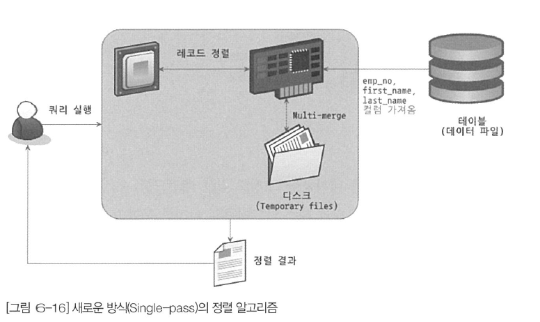
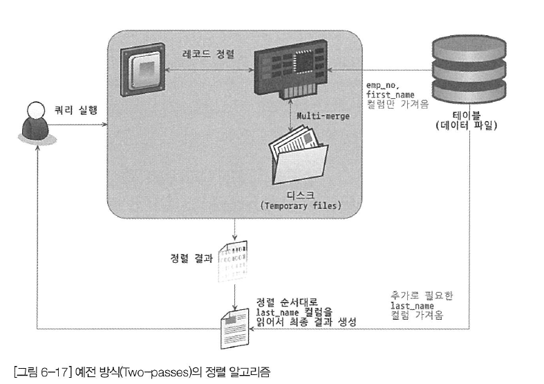

# ch9. 옵티마이저와 힌트

# 9.1 개요

쿼리의 결과는 동일하지만, 어떠한 과정을 거쳤는지는 천차만별이다. 대부분의 DBMS에서의 옵티마이저는 여러 과정속에서 최적의 쿼리 실행 계획을 찾아서 최소한의 비용으로 쿼리를 실행한다. 쿼리를 최적으로 실행하기 위해 각 테이블의 데이터가 어떤 분포로 저장돼 있는지 통계 정보를 참조하며, 기본 데이터를 비교해 최적의 실행 계획을 수립하는 작업을 한다.

<aside>
☝ 실행계획을 이해할 수 있어야만, 실행 계획의 불합리한 부분을 찾아내고, 더 최적화 된 방법으로 유도(힌트)를 할 수 있다.

</aside>

## 9.1.1 쿼리 실행 절차

MySQL 서버의 쿼리 실행 과정을 아래와 같이 3단계로 나눌 수 있다.

1. 사용자로부터 요청된 SQL 문장을 MySQL 서버가 이해할 수 있는 수준으로 잘게 쪼개서 분리(파스 트리)한다. (SQL 파스 트리 생성)
    1. 이 과정을 `SQL 파싱`이라고 한다.
    2. MySQL 엔진은 이 과정에서 SQL 파서 모듈을 사용한다.
2. SQL의 파싱 정보(파스 트리)를 확인하면서 어떤 테이블부터 읽고 어떤 인덱스를 이용해 테이블을 읽을지 선택한다. (옵티마이저 담당)
3. 두 번째 단계에서 결정된 테이블의 읽기 순서나 선택된 인덱스를 이용해 스토리지 엔진으로부터 데이터를 가져온다. (MySQL 엔진 ↔ 스토리지 엔진, 함께 처리!)

**2 번째 단계에서는 SQL 파스 트리를 참조해 다음 작업을 처리하면서 최적화 및 실행 계획 수립을 한다.**

- 불필요한 조건 제거 및 복잡한 연산의 단순화
- 여러 테이블의 조인이 있는 경우 어떤 순서로 테이블을 읽을지 결정
- 조건과 인덱스 통계 정보를 이용해 사용할 인덱스 결정
- 가져온 레코드들을 가공해야 하는지 결정

## 9.1.2 옵티마이저의 종류

현재 대부분의 DBMS가 선택하고 있는 비용 기반 최적화(CBO) 방법과 초기 오라클에서 많이 사용했던 규칙 기반 최적화 방법(RBO)으로 크게 나뉜다.

- 규칙 기반 최적화
    - 테이블의 레코드 수, 선택도 등을 고려하지 않음 (통계 정보 사용 X)
    - 옵티마이저의 내장된 우선순위에 따라 실행 계획 수립
    - 동일한 쿼리에 거의 동일한 실행 방법 생성
- 비용 기반 최적화
    - 하나의 쿼리에 대한 여러 가지 가능한 방법을 생성
    - 단위 작업의 비용 정보와 대상 테이블의 예측된 통계 정보를 이용해 실행 계획별 비용 산출
    - 산출된 실행 방법별 최소 비용의 처리 방식을 선택

# 9.2 기본 데이터 처리

모든 RDBMS는 데이터를 정렬하거나 그루핑하는 기본 데이터 가공 기능이 있다. 하지만 RDBMS별로 만들어내는 과정을 천차만별이다. MySQL은 어떤 알고리즘을 사용하는지 살펴보자.

## 9.2.1 풀 테이블 스캔과 풀 인덱스 스캔

다음 조건일 때 주로 풀 테이블 스캔을 사용한다.

- 테이블의 레코드 건수가 너무 작은 경우(일반적으로 테이블이 페이지 1개로 구성된 경우)
- WHERE 절이나 ON 절에 인덱스를 이용할 수 있는 조건이 없는 경우
- 인덱스 레인지 스캔이 가능하더라도, 옵티마이저가 판단한 조건 일치 레코드 건수가 너무 많은 경우

<aside>
☝ 대부분 DBMS는 풀 테이블 스캔을 실행할 때, 한꺼번에 여러 개의 블록이나 페이지를 읽어오는 기능을 내장하고 있다. → 리드 어헤드(Read ahead)

</aside>

리드 어헤드(Read ahead) 작업이란, 어떤 영역의 데이터가 앞으로 필요해질 것을 예측해서 **요청이 오기전에 미리 디스크에서 읽어**와 InnoDB **버퍼 풀에 가져다 두는 것**을 의미한다.

InnoDB 스토리지 엔진은 다음과 같은 상황에서 `리드 어헤드`를 작동시킨다.

1. 풀 테이블 스캔이 시작되고, 처음 몇 개의 데이터 페이지는 포그라운드 스레드에서 처리한다.
2. 특정 테이블의 연속된 데이터 페이지가 읽히면, 읽기 작업을 백그라운드 스레드로 넘긴다.
3. 이 시점부터는 한번에 4개 또는 6개씩 페이지를 읽으면서 점점 증가시킨다. (최대 64개 페이지)

### 9.2.3.2 정렬 알고리즘

> **소트 버퍼(Sort Buffer)**
> 
> - 정렬을 수행하기 위해 MySQL로부터 할당받은 별도의 메모리 공간
- 싱글 패스(Single-pass)
    - 레코드를 정렬할 때 레코드 전체를 소트 버퍼에 담는 정렬 모드
- 투 패스(Two-pass)
    - 레코드를 정렬할 때 정렬 기준 칼럼만 소트 버퍼에 담는 정렬 모드
- 옵티마이저 트레이스 기능
    - 정렬을 수행하는 쿼리가 어떤 정렬 모드를 사용하는지 확인할 수 있음

```sql
// 옵티마이저 트레이스 활성화
mysql> SET OPTIMIZER_TRACE="enabled=on", END_MARKERS_IN_JSON=on;
mysql> SET OPTIMIZER_TRACE_MAX_MEM_SIZE=1000000;

// 쿼리 실행
mysql> SELECT * FROM employees ORDER BY last_name LIMIT 100000, 1;

// 트레이스 내용 확인
mysql> SELECT * FROM INFORMATION_SCHEMA.OPTIMIZER_TRACE \G
...
				"**filesort_summary**" : {
					"memory_available" : 262144,
          "key_size" : 32,
          "row_size" : 169,
          ...
          "**sort_algorithm**" : "std::stable_sort",            -- // 정렬 알고리즘
          "**sort_mode**" : "<fixed_sort_key, packed_additional_fields>"
      }    /* filesort_summary */
```

- MySQL 서버의 정렬 방식
    - <sort_key, rowid> `**투 패스**`
        - 정렬 키와 레코드의 로우 아이디만 가져와서 정렬하는 방식
    - <sort_key, additional_fields> `**싱글 패스**`
        - 정렬 키와 레코드 전체를 가져와서 정렬하는 방식
        - 레코드의 칼럼들은 고정 사이즈로 메모리 저장
    - <sort_key, packed_additional_fields> `**싱글 패스**`
        - 정렬 키와 레코드 전체를 가져와서 정렬하는 방식
        - 레코드의 칼럼들은 가변 사이즈로 메모리 저장

### 9.2.3.2.1 싱글 패스 정렬 방식

- 소트 버퍼에 정렬 기준 칼럼을 포함해 SELECT 대상이 되는 칼럼 전부를 담아서 정렬을 수행

```sql
mysql> SELECT emp_no, first_name, last_name
			 FROM employees
			 ORDER BY first_name;
```

- 싱글 패스 정렬 방식의 처리 절차
    - employees 테이블 읽음
    - 정렬에 필요하지 않은 last_name 칼럼까지 전부 읽음
    - 소트 버퍼에 담고 정렬 수행
    - 정렬 완료 시, 정렬 버퍼의 내용을 그대로 클라이언트로 넘김



### 9.2.3.2.2 투 패스 정렬 방식

- 정렬 대상 칼럼과 primary key 값만 소트 버퍼에 담아서 정렬 수행
- 정렬된 순서대로 다시 primary key로 테이블을 읽어서 SELECT할 칼럼을 가져오는 정렬 방식
- MySQL 8.0에서도 여전히 특정 조건에서는 해당 방식 사용
- 투 패스 정렬 방식의 처리 절차
    - employees 테이블 읽음
    - 정렬에 필요한 first_name과 primary key인 emp_no 만 읽어서 정렬 수행
    - 정렬이 완료되면 그 결과 순서대로 employees 테이블을 한 번 더 읽어서 last_name 가져옴
    - 정렬 완료 시, 정렬 버퍼의 내용을 그대로 클라이언트로 넘김



- 투 패스 방식 vs 싱글 패스 방식
    - 투 패스
        - MySQL의 예전 정렬 방식
        - 테이블을 두 번 읽어야 하기 때문에 상당히 불합리
        - 정렬 대상 레코드의 크기나 건수가 상당히 많은 경우 효율적
    - 싱글 패스
        - 더 많은 소트 버퍼 공간 필요
        - 정렬 대상 레코드의 크기가 건수가 작은 경우 빠른 성능을 보여줌
- 일반적으로는 싱글 패스 정렬 방식 사용
- 하지만 다음의 경우, 투 패스 정렬 방식 사용
    - 레코드의 크기가 `max_length_for_sort_data` 시스템 변수에 설정된 값보다 클 때
    - BLOB이나 TEXT 타입의 칼럼이 SELECT 대상에 포함할 때
    

### 9.2.3.3 정렬 처리 방법

- 쿼리에 ORDER BY가 사용되면 반드시 3가지 처리 방법 중 하나로 정렬이 처리됨
    - 아래 방법으로 갈수록 처리 속도 down

| 정렬 처리 방법 | 실행 계획의 Extra 칼럼 내용 |
| --- | --- |
| 인덱스를 사용한 정렬 | X |
| 조인에서 드라이빙 테이블만 정렬 | "Using filesort" 메시지 표시 |
| 조인에서 조인 결과를 임시 테이블로 저장 후 정렬 | "using temporary; Using filesort" 메시지 표시 |
- 정렬 처리 순서
    - 옵티마이저 : 정렬 처리를 위해 인덱스를 이용할 수 있을지 검토
    - 인덱스 이용 가능 시,
        - 별도의 “Filesort” 과정 없이 인덱스를 순서대로 읽어서 결과 반환
    - 인덱스 사용 불가 시,
        - WHERE 조건에 일치하는 레코드를 검색해 정렬 버퍼에 저장하면서 정렬을 처리(Filesort)
- MySQL 옵티마이저는 정렬 대상 레코드를 최소화하기 위해 다음 방법 중 하나를 선택
    - 조인의 드라이빙 테이블만 정렬한 다음 조인을 수행
    - 조인이 끝나고 일치하는 레코드를 모두 가져온 후 정렬을 수행

### 9.2.3.3.1 인덱스를 이용한 정렬

- 인덱스를 이용한 정렬
    - ORDER BY에 명시된 칼럼이 제일 먼저 읽는 테이블(JOIN 시, 드라이빙 테이블)에 속해야함
    - ORDER BY의 순서대로 생성된 인덱스가 있어야함
    - WHERE 절에 첫 번째로 읽는 테이블의 칼럼에 대한 조건 시,
        - 그 조건과 ORDER BY는 같은 인덱스를 사용할 수 있어야함
    - B-Tree 계열의 인덱스가 아니면 인덱스를 이용한 정렬 사용 불가
        - R-Tree, 해시 인덱스, 전문 검색 인덱스 등 사용 불가
    - 여러 테이블 조인 시, [네스티드-루프(Nested-loop)](https://coding-factory.tistory.com/756) 방식의 조인에서만 사용 가능
- 인덱스를 이용해 정렬이 처리되는 경우
    - 실제 인덱스의 값이 정렬돼 있으므로 인덱스의 순서대로 읽기만 하면 됨
    - 실제 MySQL 엔진에서 별도의 정렬을 위한 추가 작업은 수행 안함
- 예제
    - ORDER BY 절이 없어도 정렬되는 이유
    - employees 테이블의 Primary key를 읽고, 그 다음으로 salaries 테이블을 조인했기 때문

```sql
-- // emp_no 칼럼으로 정렬이 필요한데, 인덱스를 사용하면서 자동 정렬이 된다고
-- // 일부러 ORDER BY emp_no를 제거하는 것은 좋지 않은 선택이다.
SELECT * FROM employees e, salaries s
WHERE s.emp_no = e.emp_no
	AND e.emp_no BETWEEN 100002 AND 100020
ORDER BY e.emp_no;
```

](images/9.2.3.3.png)

출처 : [https://hyuuny.tistory.com/208](https://hyuuny.tistory.com/208)

### 9.2.3.3.2 조인의 드라이빙 테이블만 정렬 (조인 전 정렬)

- 일반적으로 조인이 수행되면 결과 레코드의 건수가 몇 배로 불어나고
- 레코드 하나하나의 크기도 늘어남
- 조인 실행 전, 첫 번째 테이블의 레코드를 먼저 정렬하고 조인을 실행하는 것이 정렬에 도움
    - 위의 정렬 처리를 위한 조건으로
    - 조인에서 첫 번째로 읽히는 테이블(드라이빙 테이블)의 칼럼만으로 ORDER BY 절 작성
- 예제
    - WHERE 절이 다음 2가지 조건을 갖춤
        - WHERE 절의 검색 조건은 employees 테이블의 PK를 이용해 검색하면 작업량을 줄일 수 있음
        - 드리븐 테이블(salaries)의 조인 칼럼인 emp_no 칼럼에 인덱스 있음
    - 위 2가지 조건에 의해 employees 테이블을 드라이빙 테이블로 선택

```sql
SELECT *
FROM employees e, salaries s
WHERE s.emp_no=e.emp_no
		AND e.emp_no BETWEEN 100002 AND 100010
ORDER BY e.last_name;
```

- 옵티마이저는 드라이빙 테이블만 검색해서 정렬을 먼저 수행
- 그 결과와 salaries 테이블을 조인함
- 해당 과정
    1. 인덱스를 이용해 `emp_no BETWEEN 100002 AND 100010` 조건을 만족하는 9건 검색
    2. 검색 결과를 `last_name` 칼럼으로 정렬을 수행(filesort)
    3. 정렬된 결과를 순서대로 읽으면서 `salaries` 테이블과 조인을 수행해 86건의 최종 결과를 가져옴(아래 그림의 오른쪽에 번호는 레코드가 조인되어 출력되는 순서를 의미).

](images/9.2.3.4.png)

출처 : [https://hyuuny.tistory.com/208](https://hyuuny.tistory.com/208)

### 9.2.3.3.3 임시 테이블을 이용한 정렬 (조인 후 정렬)

- 쿼리가 하나의 테이블로부터 SELECT 해서 정렬하면 임시 테이블 불필요
- 하지만 2개 이상의 테이블을 조인해서 그 결과를 정렬해야하면 임시 테이블 필요 가능성 있음
- “조인의 드라이빙 테이블만 정렬”을 제외한 패턴 쿼리
    - 항상 조인 결과를 임시 테이블에 저장 후, 결과 재정렬
- 즉, 정렬할 레코드 건수가 많은만큼 가장 느린 정렬 방법
- 예제
    - 드라이빙 테이블만 정렬의 예제에서 ORDER BY 절의 칼럼만 제외하고 같은 쿼리
    - 위의 예제와 같은 이유로 employees : 드라이빙 테이블, salaries : 드리븐 테이블
    - 이번 쿼리는 드리븐 테이블이 정렬기준으로 선택됨
    - 즉, 정렬 수행 전 salaries 테이블을 읽어야 하므로 이 쿼리는 조인된 데이터를 가지고 정렬

```sql
SELECT *
FROM employees e, salaries s
WHERE s.emp_no=e.emp_no
    AND e.emp_no BETWEEN 100002 AND 100010
ORDER BY s.salary;
```

](images/9.2.3.5.png)

출처 : [https://hyuuny.tistory.com/208](https://hyuuny.tistory.com/208)

### 9.2.3.3.4 정렬 처리 방법의 성능 비교

- 주로 웹 서비스용 쿼리에는 ORDER BY와 함께 LIMIT이 거의 필수로 사용
- 하지만 ORDER BY나 GROUP BY 같은 작업은 WHERE 조건을 만족하는 레코드를 LIMIT 건수만큼만 가져와서 처리할 수 없음
- WHERE 조건이 아무리 인덱스를 잘 타도록 튜닝해도 잘못된 ORDER BY나 GROUP BY 때문에 쿼리가 느려질 수 있음
- 인덱스를 사용한 정렬방식 : 스트리밍 형태의 처리
- 나머지 : 버퍼링된 후에 정렬 처리

### 9.2.3.3.4.1 스트리밍 방식

- 서버 쪽에서 처리할 데이터가 얼마인지에 관계없이 조건에 일치하는 레코드가 검색될 때마다 바로바로 클라이언트로 전송해주는 방식
- 이 방식으로 쿼리 처리할 경우
    - 클라이언트는 쿼리를 요청하고 곧바로 원했던 첫 번째 레코드를 전달받음
- 쿼리가 스트리밍 방식으로 처리된다면
    - 클라이언트는 MySQL 서버가 일치하는 레코드를 찾는 즉시 전달받음
    - 때문에 동시에 데이터의 가공 작업을 시작할 수 있음
    - 쿼리가 얼마나 많은 레코드를 조회하느냐에 상관없이 빠른 응답시간 보장
    - LIMIT 조건을 추가하면 가져오는 전체 레코드 건수가 줄어들음
    - 때문에 마지막 레코드를 가져오기까지의 시간을 상당히 줄일 수 있다.
- 웹 서비스 같은 OLTP 환경에서 사용
    
    > OLTP(온라인 트랜잭션 처리)
    > 
    > - 온라인 뱅킹, 쇼핑, 주문 입력 또는 텍스트 메시지 전송 등 동시에 발생하는 다수의 트랜잭션을 실행하는 데이터 처리 유형
    > - 쿼리를 실행하고, 데이터 무결성을 유지하는 것을 목표
    > - 예) ATM 기계
    >     - 카드 삽입 → 카드 정보 인식 → 돈 입금 → 정상 확인 → 확인 후 통장에 돈 입금
    >     - 과정 중 하나라도 오류가 발생 시, 모든 과정을 취소(rollback) 및 처음으로 회귀

### 9.2.3.3.4.2 버퍼링 방식

- ORDER BY 나 GROUP BY 같은 처리는 쿼리의 결과가 스트리밍되는 것이 불가능
- WHERE 조건에 일치하는 모든 레코드를 가져온 후, 정렬하거나 그루핑해서 차례대로 보내야함
- 버퍼링
    - MySQL 서버에서는 모든 레코드를 검색하고 정렬 작업을 하는 동안
    - 클라이언트는 아무것도 하지 않고 기다려야 하기 때문에 응답 속도가 느려짐
- 버퍼링 방식으로 처리되는 쿼리
    - 먼저 결과를 모아서 MySQL 서버에서 일괄 가공해야 함
    - 모든 결과를 스토리지 엔진으로부터 가져올 때까지 기다려야 함
    - LIMIT 제한을 해도 성능 향상에 도움이 되지 않음
    - 레코드 건수는 줄어도 서버의 작업량에 변화가 없음
- 예시
    - tb_test1 테이블의 레코드 : 100건
    - tb_test2 테이블의 레코드 : 1000건
    - 두 테이블의 조인 결과 : 전체 1000건 가정 (tb_test1 1건당 tb_test2 10건 씩 존재)

```jsx
SELECT *
FROM tb_test1 t1, tb_test2 t2
WHERE t1.col1=t2.col2
ORDER BY t1.col2
LIMIT 10;
```

- `tb_test1`이 드라이빙되는 경우

| 정렬 방식 | 읽어야 할 건수 | 조인 횟수 | 정렬해야 할 대상 건수 |
| --- | --- | --- | --- |
| 인덱스 사용 | tb_test1 : 1건 
tb_test2 : 10건 | 1번 | 0건 |
| 드라이빙 테이블만 정렬 | tb_test1 : 100건 
tb_test2 : 10건 | 10번 | 100건 
(tb_test1 테이블의 레코드 건수만큼 정렬 필요) |
| 임시 테이블 사용 후 정렬 | tb_test1 : 100건 
tb_test2 : 1000건 | 100번 
(tb_test1 테이블의 레코드 건수만큼 조인 발생) | 1,000건
(조인된 결과 레코드 건수를 전부 정렬해야 함) |
- `tb_test2`가 드라이빙되는 경우

| 정렬 방식 | 읽어야 할 건수 | 조인 횟수 | 정렬해야 할 대상 건수 |
| --- | --- | --- | --- |
| 인덱스 사용 | tb_test2 : 10건 
tb_test1 : 10건 | 10번 | 0건 |
| 드라이빙 테이블만 정렬 | tb_test2 : 1000건 tb_test1 : 10건 | 10번 | 1,000건
 (tb_test2 테이블의 레코드 건수만큼 정렬 필요) |
| 임시 테이블을 사용한 후 정렬 | tb_test2 : 1000건 tb_test1 : 100건 | 1,000번
 (tb_test2 테이블의 레코드 건수만큼 조인 발생) | 1000건
 (조인된 결과 레코드 건수 를 전부 정렬해야 함) |
- 어느 테이블이 먼저 드라이빙되어 조인되는지도 중요하지만
- 어떤 정렬 방식으로 처리되는지는 더 큰 성능 차이를 만듦

### 9.2.3.4 정렬 관련 상태 변수

- `Sort_merge_passes` : 멀티 머지(multi merge) 처리 횟수
- `Sort_range`  : 인덱스 레인지 스캔을 통해 검색된 결과에 대한 정렬 작업 횟수
- `Sort_rows` : 지금까지 정렬한 전체 레코드 건수 작업 횟수
- `Sort_scan` : 풀 테이블 스캔을 통해 검색된 결과에 대한 정렬

```jsx
mysql > SHOW SESSION STATUS LIKE 'Sort%';
+---------------------+---------+
| Variable name       | Value   |
+---------------------+---------+
| Sort_merge_passes   | 13      |
| Sort_range          | 0       |
| Sort_rows           | 30024   |
| Sort_scan           | 1       |
+---------------------+---------+
```